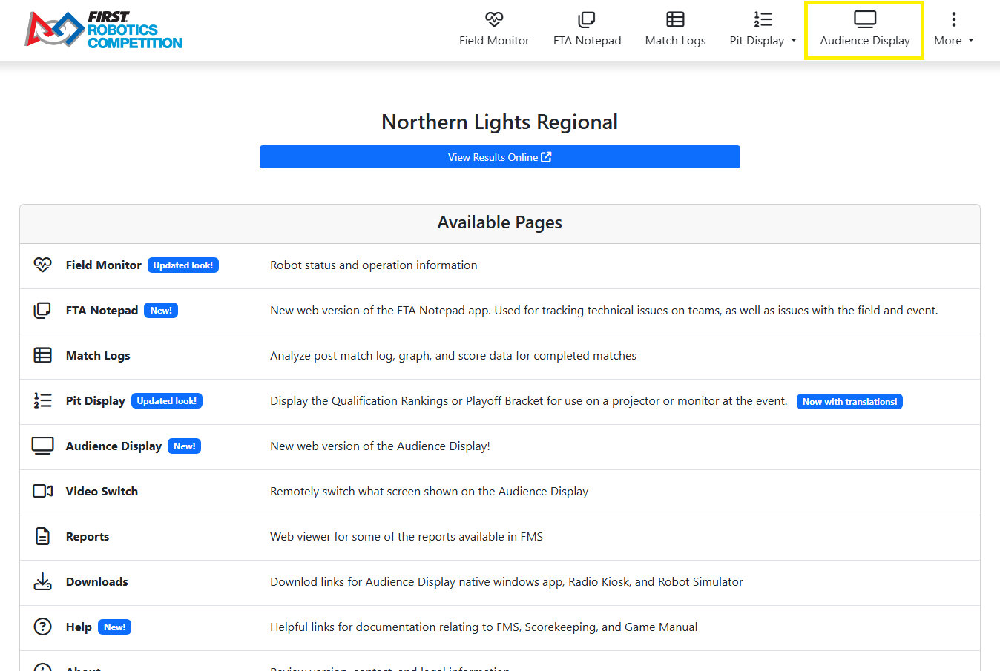
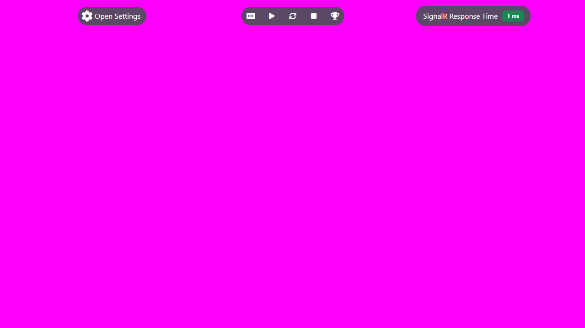

.. _audience-about-web-index:

About Audience Display (Web Version)
====================================

Introduction
------------

Audience Display is a software program, built and distributed by *FIRST* that is used to relay game and status information from FMS to the Audience at the venue and online
(via the live stream, if applicable). The Audience Display can either be run as a standalone application or as a web app on a separate machine connected to the field network via Ethernet, it cannot run on *FIRST* 
Servers. This manual will walk through the available displays, configuration options, and best practices related to the Audience Display.

Wiring Audience Display
-----------------------

In order to connect to FMS, the Audience Display must have a wired connection to FMS. The Audience Display needs to be on the same network as the FMS
machine. 

Opening Audience Display
------------------------

| 
| To open the Audience Display, go to `10.0.100.5` in a browser on the Audience Display laptop. Once that website loads, click on "Audience Display" in the top nav bar (**yellow box**). In most cases, only a single instance is needed. In some cases, it may be useful to have a second instance running to retrieve additional graphics or looks. Consult with the FTA and/or *FIRST* Engineering before using the second Display. Upon opening the Audience Display, it will automatically go to either the Background, or if instructions are actively being sent (such as during a match) will jump to the appropriate position for that point in time.

Audio Output
------------

The game sounds commonly associated with FRC events, such as the start of match 'charge' sound and the end of match buzzer, are processed by the Audience Display. On *FIRST*
official fields, output is made available for the venue from either a standard 1/8" female connection ("headphone jack") on a laptop that runs the Audience Display, or the HDMI connection
(if using HDMI for video as well). Either audio configuration can be configured using Windows Audio configuration.

.. note::
   In order to hear game sounds, the Audience Display program must be running

Event Setup Order
-----------------

It is highly recommended that you do not run the Audience Display program until after initial configuration of the event is complete through
the Event Wizard. Opening the programs out of order may result in freezing while event data is attempting to process.

Hover Menu
----------

The Audience Display has a Hover Menu, accessible by simply hovering over the display. The menu provides quick access actions and indicators.

| 
| From left to right, the hover icons are:

[**Open Settings**] Open the settings panel, the same as using the hotkey combination

[**Play Sound Once**] Play a single test sound

[**Play Sound Looping**] Loop a test track for audio testing and tuning

[**Stop Playing sound**] Stops any sound being played by using either of the previous two buttons

[**Play Match Result Animation Test**] Runs the Post-Result animation one time in order to verify render quality

[**SignalR Response Time**] This is a live updating indicator of the amount of time it takes for SignalR events (timers, scores, screen changes, etc.) to get from the FMS Server to the Audience Display.

Closing Audience Display
------------------------

To close the software, either click the back button in the browser to go back to the local FMS website or close the tab.
