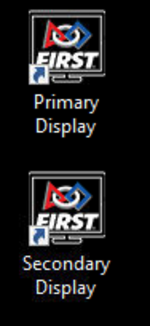
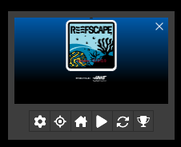

.. include:: <isonum.txt>
.. _audience-about:

About Audience Display
======================

Introduction
------------

Audience Display is a software program, built and distributed by *FIRST*\ |reg| that is used to relay game and status information from FMS to the Audience at the venue and on the web
(via the webcast, if applicable). The Audience Display can only be run as a standalone application on a separate machine connected to the field network via Ethernet, it cannot run on FIRST 
Servers. This manual will walk through the available displays, configuration options, and best practices related to the Audience Display.

.. important::
   Please do not install the Audience Display on official *FIRST* |reg| servers ("case 33") - use the laptop marked for Audience Display use instead

Wiring Audience Display
-----------------------

In order to connect to FMS, the Audience Display must have a wired connection to FMS. The Audience Display needs to be on the same network as the FMS
machine, and no additional LANs. 

Opening Audience Display
------------------------

To open the Audience Display, after installation, simply double-click on the television icon containing the *FIRST* logo. A splash screen will be displayed while background processes
complete, and the display will go to either the Background, or, if instructions are actively being sent (such as during a match) will jump to the appropriate position for that point in time.

Audio Output
------------

The game sounds commonly associated with FRC\ |reg| events, such as the start of match 'charge' sound and the end of match buzzer, are processed by the Audience Display. On *FIRST*
official fields, output is made available for the venue from either a standard 1/8" female connection ("headphone jack") on a laptop that runs the Audience Display, or the HDMI connection
(if using HDMI for video as well). Either audio configuration can be configured using Windows Audio configuration.

.. note::
   In order to hear game sounds, the Audience Display program must be running

Event Setup Order
-----------------

It is highly recommended that you do not run the Audience Display program until after initial configuration of the event is complete through
the Event Wizard. Opening the programs out of order may result in freezing while event data is attempting to process.

Jump Menu
---------

The Audience Display has a Jump Menu, accessible by right-clicking the Audience Display icon in the Taskbar. The Jump menu provides additional functionality not accessible anywhere
else in the Audience Display. You can enable expanded options by clicking CTRL+SHIFT+D while the Audience Display is the active window. The Jump Menu may not be enabled if you are
using Windows 10 Home Edition. Ask HQ Support for help if you need additional help using the Jump Menu.

Closing Audience Display
------------------------

To close the software, either right-click on the taskbar icon and select 'Close window' or use the Windows hotkey combination of ALT-F4 (making sure the active window is the Audience Display)
