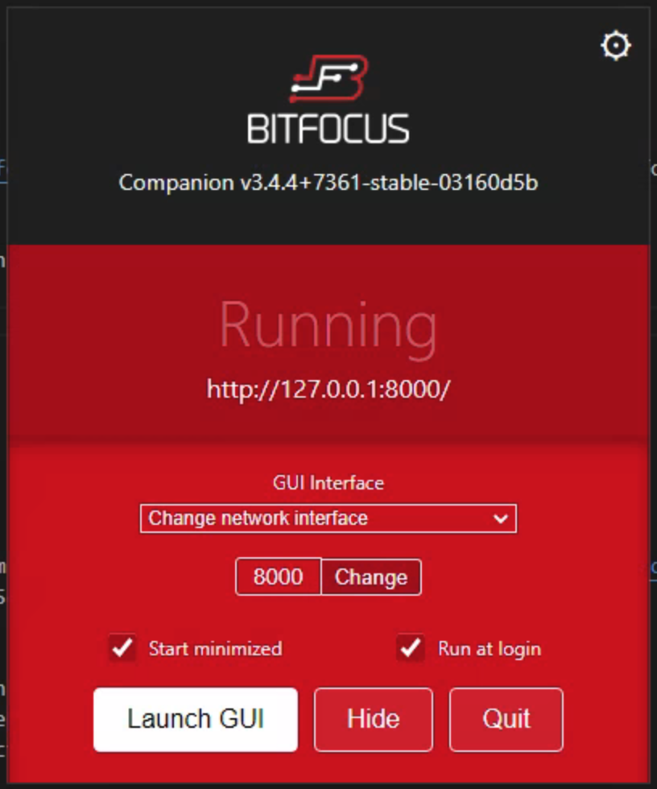
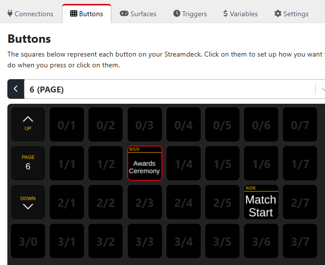
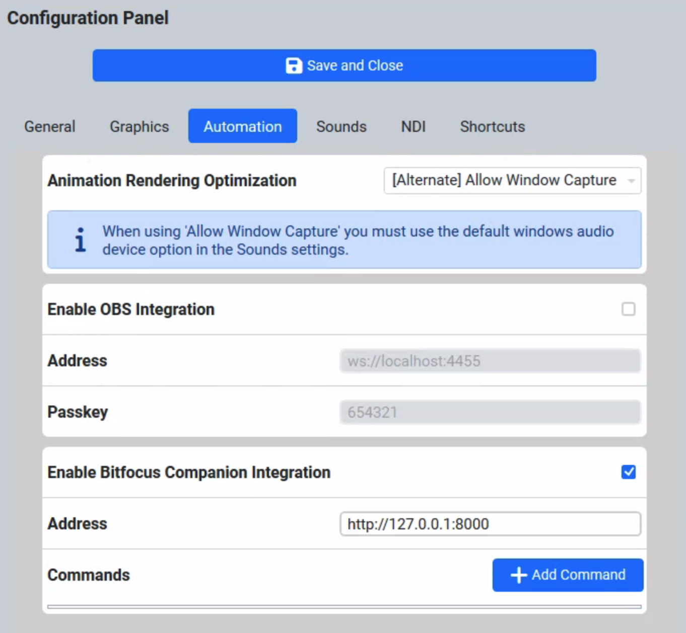
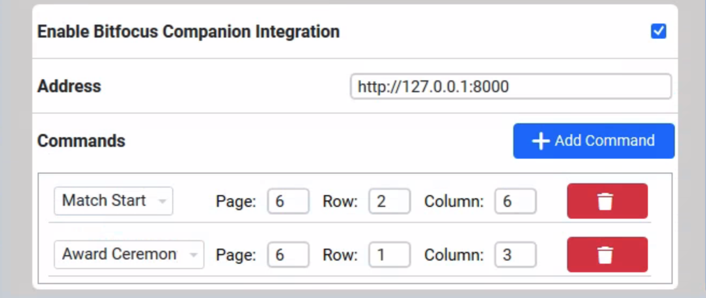

.. include:: <isonum.txt>
.. _audience-automation-bitfocus:

BitFocus Companion
==================

BitFocus Integration must be configured through the settings' automation tab and is considered an advanced feature. You should only use this integration if you are familiar 
with computer networking.

BitFocus Companion is an incredibly popular audio/video/production control program that allows you to control almost any network-capable equipment (such as video mixers or audio consoles).
The free Companion Software and use of the *FIRST* Audience Display allows automation based on event progression and may eliminate the need for one or more operators. Follow the below steps 
to configure and use BitFocus Companion.

For the remainder of this documentation, the product will be referred to simply as "Companion"

Recommended Setup
----------------------------

referred can only dispatch commands to devices that share a network connection, and therefore, the devices must be on the same network as the BitFocus installation. 
However it is critical not to add production equipment (or any unknown equipment) to the field network with *FIRST* Engineering permission. Instead, the recommended practice 
is to have two Ethernet NICs on the Companion target machine. One NIC will live on the field network (and receive a DHCP address of 10.0.100.*) and the other can live on 
the network with the production equipment to be controlled (which must not be 10.*). 

.. note::
   The Audience Display does not need to run on the same computer as Companion, they only need to communicate via Ethernet

Download and Installation
----------------------------

Download Companion (made by the company "BitFocus") from their website at `https://bitfocus.io/companion <https://bitfocus.io/companion>`_ for your Operating System.

.. note::
   A free account is required to download Companion, but no login is required once installation is complete

Install Companion and launch it using the icon or shortcut. Open the configuration window and verify your settings. At a minimum, it is recommended to 
have "Run at login" checked. Depending on your setup you may need to change the port (default is 8000) or the network interface. Do not set the port to 80 or 443. 
After changing settings, be sure to click "Hide" and *not* "Quit" as Companion must remain running in the background for this integration to work.

|

Determine Events of Interest
----------------------------

Audience Display requires the user to select from possible events to tie to Companion buttons. The following events are available to pick from:

* *Prestart* - triggered when the process of configuring the field for a match begins
* *Match Preview* - triggered when the Scorekeeper displays the upcoming match information to the audience
* *Set Audience* - triggered when the Scorekeeper displays the match score bar to the audience
* *Match Start* - triggered when the Autonomoud period begins
* *Teleop Start* - triggered when the Teleoperted period begins, after any automated scoring thresholds have elapsed
* *Endgame Start* - in games with a designated endgame period, triggered when the endgame warning sound plays to the audience
* *Match End* - triggered when the Teleoperated period timer expires
* *Post Result* - triggered when the final scores are display to the audience
* *Alliance Selection* - triggered when the Scorekeeper shows the Alliance Selection screen to the audience
* *Award Ceremony* - triggered when the Scorekeeper shows an Award related screen to the audience

.. warning:: 
   Alliance Selection and Award Ceremony states are reliant on Scorekeeper action. It should not be assumed that these states are the official "Start" of a 
   given ceremony or process, simply reflective of the information being shown to the Audience. In cases such as Awards, the state is not recalled upon 
   each award presented, simply the first time the state changes.

Setup Companion Buttons
----------------------------

Open the Companion web interface by using the "Launch GUI" button in the settings panel or visiting localhost:8000 (or whichever port has been configured). 
Configure the buttons for the events you wish to subscribe to from the previously outlined list of options. This documentation will not detail how to 
configure individual actions for Companion buttons, instead more information can be found `on their support page <https://bitfocus.io/companion/support>`_ or by watching videos online.

|
| In the above example, there is a button of interest for Alliance Selection located on page 6, row 1, column 3 (or 6/1/3). There is also a button for Match Start 
   located at 6/2/6. Save this information for use when configuring the Audience Display. What Audience Display will do when making a call to Companion is exactly the 
   same as pressing the button on a physical surface (such as an Elgato StreamDeck) or in the online GUI. This includes both the "button down" and "button up" states.

.. note::
   There could be as many additional buttons as desired on any number of pages, Audience Display will simply ignore irrelevant buttons. Notice the numbering scheme 
   for Companion is often 0-based.

Audience Display Settings
-----------------------------

Within the Audience Display settings, check the "Enable BitFocus Companion Integration" checkbox and complete the address as configured in 
the above "Download and Installation" section. The address must be a valid URL- written with the leading http (or https). The port is 
also required as Companion should not be run on 80 or 443. Since it must be a valid url, the use of localhost must be replaced with 127.0.0.1.

|
| For each event type of interest, click the "Add Command" button and complete the associated fields. A complete configuration for the example buttons above would look like this:

    
|

.. note::
   The Audience Display can only accept a single action for each event type. If multiple downstream events need to happen based on the event trigger, they must be configured 
   to run in the button press stack within Companion.

.. warning::
   The Companion pages are not 0-indexed unlike the rows and columns. Be careful to make sure you're setting the right page in your request! You will not be able to save a config that tries to use page 0.

A Note on State Tracking
----------------------------
Please note that the Audience Display keeps track of the state internally, using a combination of FMS and Scorekeeper messages. The Audience Display will only issue commands to 
Companion when a state change is detected. This is an intentional design choice, as it prevents unnecessary duplicated commands and competing against an operator who may be 
attempting to manually navigate away from a given state.

A practical example: The Audience Display is open and running, and the Alliance Selection process begins. If a command was added, Companion will be notified of the Alliance 
Selection process state. During the ceremony, the Audience Display is closed and re-opened for some reason. When re-opened, Companion will not be notified as there has been no 
state change as far as FMS / the Scorekeeper are concerned. However, if the Scorekeeper was to run a "Test Match" and then come back to the Alliance Selection process then an 
event *would* be fired to Companion. 

.. important:: 
   Do not enable this feature without the corresponding setup in Companion as it may impact Match Play. Do not 
   enable this integrtion on more than one Audience Display within the same field network as they may compete with 
   each other.
