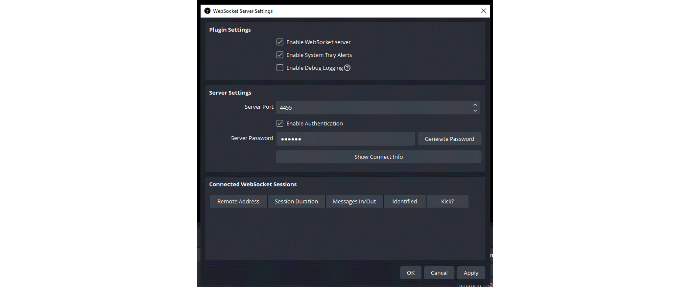
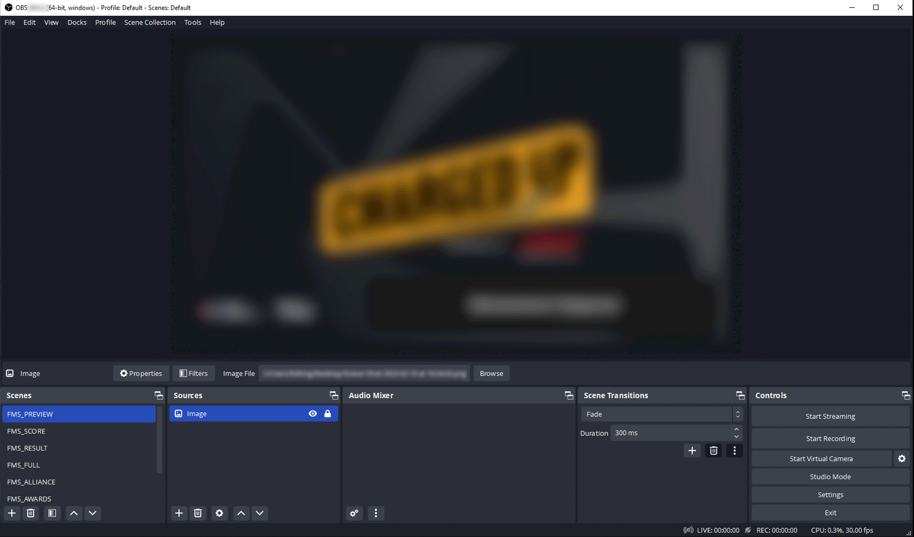
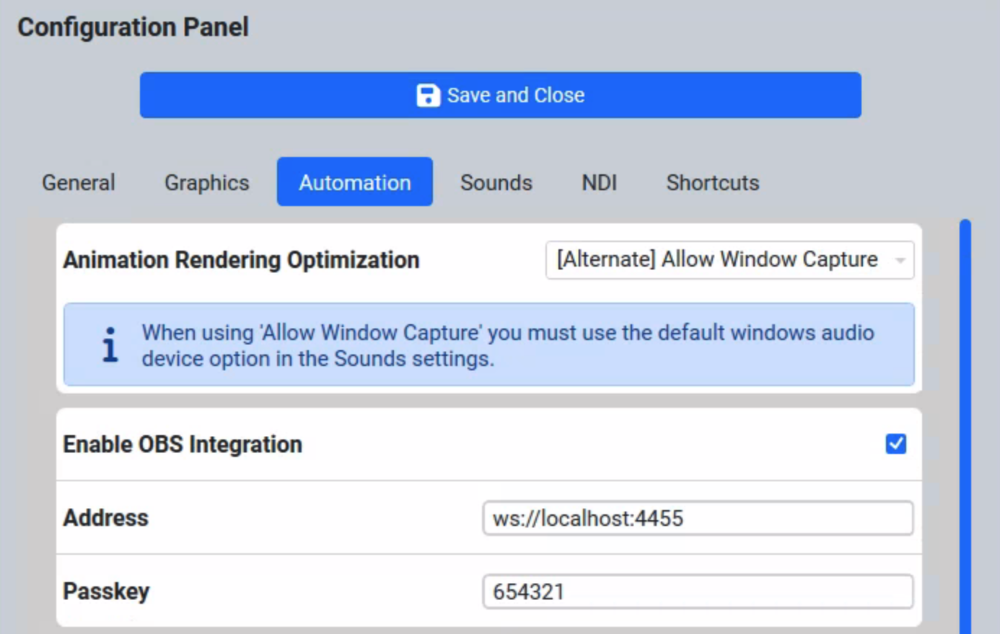

.. include:: <isonum.txt>
.. _audience-automation-obs:

OBS Websockets
==============

OBS Integration must be configured through the settings' automation tab and is considered an advanced feature.

OBS Websockets / OBS Integration allows you to control your video feed (for use on a webstream, or potentially on a scoreboard at off-season events) via the free OBS Software
and use of the *FIRST*\ Audience Display by automatically changing what the audience is seeing based on what is happening at the event without the need for an operator.
To do so, configure the two required programs as outlined below.

OBS Setup and Installation
----------------------------

.. image:: images/obs-1.png
   :alt: titlebar of OBS window

#. Install the desired version of OBS, a free open-source video streaming platform from their website at: `https://obsproject.com <https://obsproject.com>`_ Make sure to install version 29 or newer.
#. Run OBS and configure the desired scenes based on the below directions in the "OBS Scenes" section.
#. Open the Websockets Config panel in OBS under Tools

   * Make sure the Server Port is 4455 (or, if changing the default, note the selection for configuring the Audience Display)
   * Make sure the Enable authentication checkbox is on, and select a 6-digit code to encrypt the traffic.
   * It is recommended to keep System Tray Alerts on to see notifications if any connections are lost

Start the Websocket server by making sure the "Enable" checkbox is checked, then applying and closing the settings.

OBS Scene Configuration
-----------------------

The OBS Integration will tell the Audience Display to change scenes in OBS automatically as the match and event progress. In order to do so, it relies on Scenes to be named exactly
as specified in this documentation. Using the Scenes area (marked above in pink) create the Scenes you are interested in using, detailed below. Two scenes minimum are required:
FMS_FULL and FMS_HIDDEN in order for any operation to take place.

* FMS_PREVIEW - Scene for your desired output during Match Preview
* FMS_SCORE - Scene for your desired output during Match Play. It must, at minimum, show the score bar generated by FMS without any modification from how it is provided by *FIRST*. It should contain a Chroma filter to remove the portions intended to be keyed out.
* FMS_RESULT - Scene for the desired output during the Post Result after a match. At minimum, it have room for the animation that plays when scores are being revealed, and the score detail as provided by the *FIRST* Audience Display.
* FMS_FULL - This scene is required. Used in place of any scene that is not implemented from the rest of this list. It should be configured for the desired output when a full-screen display is showing from FMS, such as the messages generated by the scorekeeper. It should contain a Chroma filter to remove the portions intended to be keyed out.
* FMS_ALLIANCE - The desired look during the Alliance selection process. It should contain a Chroma filter to remove the portions intended to be keyed out. Some versions of the audience display contain boxes that are meant to be keyed out in favor of a camera look. Not all displays will have a chroma element to remove.
* FMS_AWARDS - Scene for the output during Award Ceremonies. It should accommodate the lower third bar that shows the award being presented and the winning team or person. It should contain a Chroma filter to remove the portions intended to be keyed out.
* FMS_HIDDEN - Scene is required. Used whenever the FMS Audience Display is not supposed to be seen, or has finished showing data. For example, after showing match preview for enough time for users to read it FMS will transition to this scene to hide the display. This can be made up of cameras or other graphics that are not from the Audience Display output.

.. note::
   Adding additional scenes beyond those listed is also fine, but FMS may transition away from it during match flow.

.. warning::
   Don't forget to configure the audio the desired way in each scene, or globally.

Audience Display Settings
-----------------------------

Look for the OBS Integration options in the Video tab of the Audience Display settings. Only enable the feature after enabling Websockets in the OBS software. The default address should be
sufficient for most use cases, and should contain the address (starting with WS) and including the port number (default of 4455). Select a passkey (consisting of 6 or more characters) to encrypt your connection.

.. important:: 
   Do not enable this feature without the corresponding setup in OBS as it may impact Match Play

There are no other settings to change in the Audience Display for this feature.
