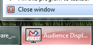

About Audience Display
======================

Introduction
------------

Audience Display is a software program, built and distributed by *FIRST* that is used to relay game and status information from FMS to the Audience at the venue. Audience Display can only be run as a standalone application on a separate machine connected to the field network via Ethernet. This manual will walk through the available displays, configuration options, and best practices related to the Audience Display.

IMPORTANT: DO NOT INSTALL THE AUDIENCE DISPLAY ON OFFICIAL FIRST SERVERS ("SCORPION CASE #33") - USE ONLY THE REMOTE AUDIENCE DISPLAY MACHINE!

Wiring Audience Display
-----------------------

In order to connect to FMS, the Audience Display must have a wired connection to FMS. The target machine (if running a remote instance) needs to be on the same network as the FMS machine (10.0.100.X), and no additional LANs. While a wired Ethernet connection is highly advised, it's possible for the Audience Display to operate on a wireless connection. For wireless access, if field wireless is available, connect to the appropriate wireless network and ensure the target machine receives an address of 10.0.100.X. Wireless networks for *FIRST* fields have different names from truck to truck, contact the FTA for additional information.

Whenever possible, the Audience Display should be on a wired Ethernet connection.

Opening Audience Display
------------------------

To open the Audience Display, after installation, simply double-click on the television icon containing the *FIRST* logo. A splash screen will be displayed while background processes complete, and the display will go to either the Background, or, if instructions are actively being sent (such as during a match) will jump to the appropriate position for that point in time.

Audio Output
------------

The game sounds commonly associated with FRC events, such as the start of match 'charge' sound and the end of match buzzer, are processed by the Audience Display. On *FIRST* official fields, output is made available for the venue from either a standard 1/8" female connection ("headphone jack") on a laptop that runs the Audience Display, or the HDMI connection (if using HDMI for video as well). Either audio configuration can be configured using Windows Audio configuration.

NOTE: IN ORDER TO HEAR GAME SOUNDS, THE AUDIENCE DISPLAY PROGRAM MUST BE RUNNING

Event Setup Order
-----------------

In order to properly synchronize with FMS, it is highly recommended that you do not run the Audience Display program until after initial configuration of the event is complete through the Event Wizard. Opening the programs out of order may result in freezing while event data is attempting to process.

Closing Audience Display
------------------------

To close the software, either right-click on the taskbar icon and select 'Close window' or use the Windows hotkey combination of ALT-F4 (making sure the active window is the Audience Display)

