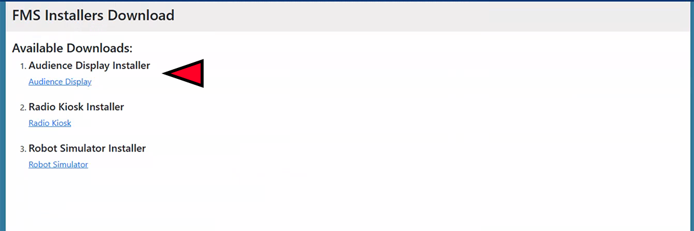

.. include:: <isonum.txt>
.. _audience-config-installation:

Installation
============

.. important::
   Please do not install the Audience Display on official *FIRST* servers ("case 33") - use the laptop marked for Audience Display use instead

Installation Overview
---------------------

The Audience Display is not supported on any platform other than Windows 10 or higher (64 Bit). The target machine must also have an Ethernet port and audio output device (headphone jack, HDMI port, etc).

The Audience Display installer can be retrieved on the field server website downloads page, :ref:`as outlined here <field-server-downloads>` and shown in the photo above.
Download the exe file, move it to the target machine (using a USB drive, for example) and run the installer in the same way that any other program would be installed on Windows.

Version Matching
----------------

The Audience Display will regularly verify itself against FMS to ensure the version numbers are the same. If they do not match, you'll see
an "FMS Mismatch" watermark shown on top of all screens until the version is updated to match the FMS version.

Communicating with FMS
----------------------

The Audience Screen must be connected to the machine hosting the FMS software via Ethernet (such as through a switch or router). In addition,
the Audience Display expects to find FMS at the IP of `10.0.100.5`. To verify connectivity from the Audience Display machine to the required IP address, 
consider using Windows Command Prompty to "ping" the address first.

It is recommended that there be no more than two (2) instances of the Audience Screen running on the FMS network at any given time. The software is not tested beyond this capacity.
