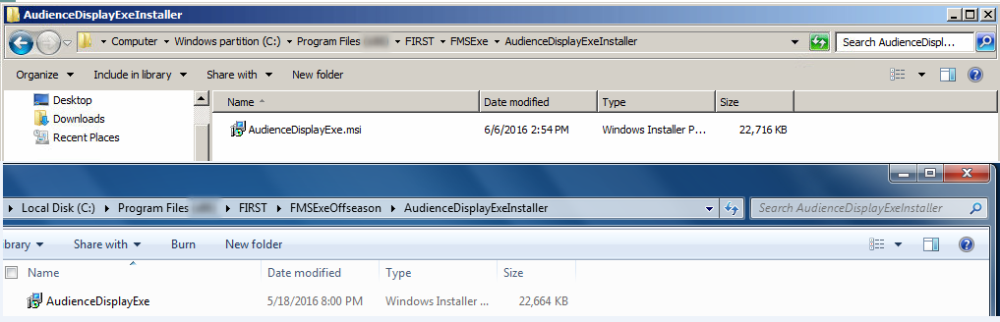

Installation
============

Running on Extended Displays
----------------------------

DO NOT INSTALL THE AUDIENCE DISPLAY ON OFFICIAL FIRST SERVERS ("SCORPION CASE #33") - USE ONLY THE REMOTE AUDIENCE DISPLAY MACHINE!

Installation on Remote Computers
--------------------------------

The Audience Display is not supported on any platform other than Windows 10 or higher. As noted later, the machine running a remote Audience Display must also have an Ethernet port.

The easiest way to obtain the Audience Display installer is to:

#. Ensure the remote Audience Display is on the FMS Network#. Open a web browser (Chrome Preferred) to the following address: http://10.0.100.5/FRCDownloads This will open a browser page to select the available applications to download.* http://10.0.100.5/FRCDownloads* This will open a browser page to select the available applications to download.

Select the Audience Display application to download.Install the Audience Display application on the local computer.

NEVER RUN THE AUDIENCE SCREEN INSTALLER ON A FIRST SERVER

Version Matching
----------------

When running on a remote computer, the Audience Display instance will verify itself against FMS to ensure the version numbers are the same. If they do not match, you’ll see an “FMS Mismatch” watermark shown on top of all screens until the version is updated/downgraded to match the FMS version.

Communicating with FMS
----------------------

When using a remote installation, the Audience Screen must be connected to the machine hosting the FMS software via Ethernet (such as through a switch or router). In addition, the installation will tell Audience Display to look for FMS at the IP of 10.0.100.5. It's recommended recommended that you ping the FMS machine from the target remote Audience Display machine to make sure the Ethernet connection has been established properly.

It is recommended that there be no more than two (2) instances of the Audience Screen running on the FMS network at any given time. The software is not tested beyond this capacity.

