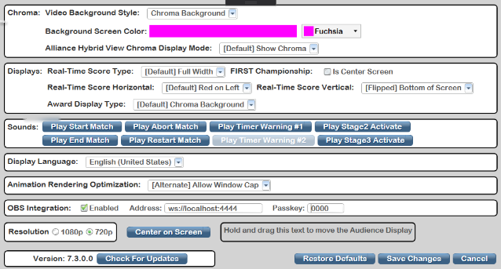
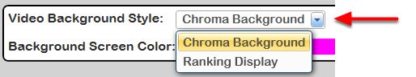
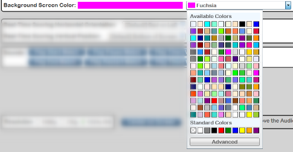
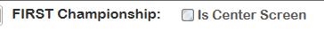
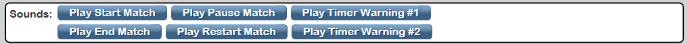
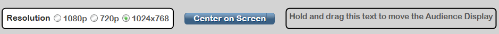
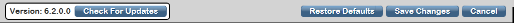
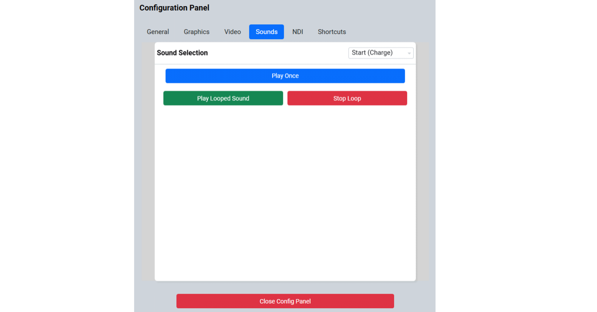
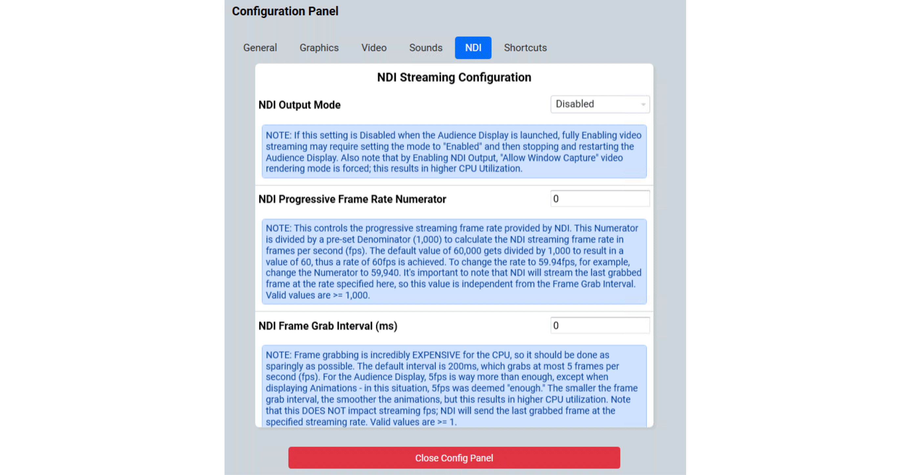
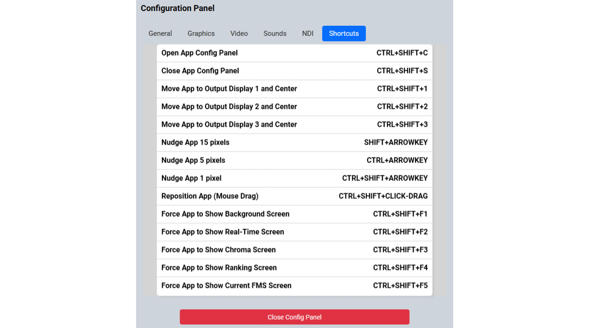

Settings
========

Details the options available through the configuration and setting panels within the Audience Display software.

Accessing Settings
------------------

To access the settings panel, with the Audience Display open and running (see `About <../../audience/l/558887?data-resolve-url=true&data-manual-id=59147>`_ ) use the hotkey combination of CTRL-SHIFT-F12 (or, alternatively, CTRL-SHIFT-C). This will trigger the upper portion of the Audience Display (or Lower, depending on the Vertical Position setting) to flip to the settings pane as shown in the graphic.

To close the settings panel, either click the 'Save Changes' button (saves changes and closes) or the 'Cancel' button (does not save changes and closes). Note that hitting 'Cancel' will not undo any adjustments you may have made to the position of the window on the screen.

Video Background Style
----------------------

The 'Video Background Style' option has two choices:

* Chroma Background* Ranking Display

This selection will control the behavior of the upper "two thirds" of the screen in the "Video Only" and "Video and Score" modes.

Chroma Background:

Show the selected color in the area, to be keyed (or cut) out and replaced with live event video from a camera or production feed. (The actually "keying" process and mixing of video would need to be done through external software, not through FMS/Audience Display)

Ranking Display:

Removes the background screen color (Chroma) and shows a ranking screen show 8 team rankings at a time. The list automatically scrolls through all the possible teams at the event, in rank order. Teams must have played one or more qualification matches to be included in the listings. Updates to the qualification rankings via out-of-band processes (such as Match Review) will not update the rankings if the rankings are shown during the update process; to update rankings, the Video Switch must be used to select another view (such as “Background”) and then reload the desired view (“Video Only” or “Video and Score”).During Playoff matches, the rankings are replaced with the playoff bracket to show progression through the tournament phase.

Background Screen Color
-----------------------

The Background Screen Color dropdown allows selection of the color which will be used for 'Chroma' process described previously. In the "Video Only" and "Video and Score" modes, the Chroma color is overlayed in the top "two thirds" of the screen to allow for video overlay. The Background Screen Color is not used if the "Video Background Style" is set to "Ranking Display" (the Background Screen Color would be hidden in this case).

In addition to the available colors in the dropdown, a specific RGB value can be specified via the "Advanced" button on the bottom. Occasionally, a production company or video software will specify a color to be used for the keying process most accurately. If no specific requests are made, the default value of "Fuchsia" or alternate of "LawnGreen" should be sufficient.

Real-Time Score Type
--------------------

Careful consideration should be used before changing these options as they can cause confusion for audience members who are "use to" a traditional layout from year to year. For official FRC Events, if in doubt, please contact your Engineering support contact.

The default option of "Full Width" is the more traditional score bar that takes up the full bottom third or so of the audience display. The alternate view, Center Third, is for use on webcast versions as arranged with FIRST HQ and provides an alternate view of the data in a more compact, centered display.

Real-Time Orientation
---------------------

Careful consideration should be used before changing these options, and they may cause confusion for audience members who are "use to" a traditional layout from year to year. For official FRC Events, if in doubt, please contact your Engineering support contact.

[ *Above Red Line* ] The horizontal orientation of the real-time scoring screen can be modified through settings to select whether the red alliance is on the left, or the right, side of the screen. At a traditional FRC Event and setup, the red alliance is setup to the right side when sitting at the scoring table. As such, a projection screen mounted above the scoring table (viewed by the audience sitting across from it) would see the red alliance on the left side when viewing the field. However, some situations (such as webcasting) display the view of the field from the same side as the scoring table. In these situations, the horizontal orientation could be flipped so that the display will properly align overlayed elements with those seen on the live video feed.

[ *Below Red Line* ] The vertical orientation allows for flipping of the "Video and Score" panel from the bottom of the Audience Display to the top. This is useful in situations where the venue has obstructed views, there is conflicting light, or it's more convenient for spectators. The only display affected by this setting is "Video and Score"- all others continue to behave the same way as they normally would.

FIRST Championship Specific
---------------------------

Some configuration options are specific to the FIRST Championship. Please do not adjust these settings at any events except under the direction of FRC Support.

Sounds
------

.. image:: images/settings-13.png

Using the third "bar" of the settings panel sounds can be force played to test the connection with the audio/video group. Depending on the season, one or more buttons may not trigger a sound to be played (2015 did not use "Warning #2" for example). Each sound plays once upon click. Additional game-specific sounds may also be present for testing as well.

Resolution and Positioning
--------------------------

.. image:: images/settings-14.png

[ *Resolutions* ] Audience Display is compatible with three (3) resolutions- 1024x768 (3:4 aspect ratio) and 1920x1080 / 1280x720 (16:9 aspect ratio). The resolution can be adjusted using the radio buttons, and takes effect upon clicking the "Save Changes" button. There are slight differences between the display of data in the various resolutions- but the critical game data remains the same.

[ *Positioning* ] To *quickly* position the Audience Display on the monitor, either click the "Center on Screen" button or "Hold and drag" on the designated area to manually adjust the placement on the screen. You can also alternatively hold CTRL-SHIFT and CLICK-DRAG the mouse on the window to drag the window around.

To *precisely* position the Audience Display on the monitor (version 3.25 or higher), you can also use CTRL-ARROW, SHIFT-ARROW, or CTRL-SHIFT-ARROW to move the display in the direction of the arrow. Each subsequent modifier (CTRL, SHIFT, CTRL-SHIFT) adjusts the display in the direction of the arrow key pressed a different incremental amount.

To precisely throw the audience display to another screen (centered) in one keystroke, use the CTRL-SHIFT-1, CTRL-SHIFT-2, and CTRL-SHIFT-3 keyboard shortcuts. These shortcuts will throw the Audience Display to Display 1, Display 2, and Display 3 as defined by Windows, respectively, and centered within the display.

Control Bar
-----------

.. image:: images/settings-17.png

On the bottom of the settings pane is the control bar. On the left is the version of the Audience Display software (which must match FMS, see `Installation <../../audience/l/558885?data-resolve-url=true&data-manual-id=59147#Version-Matching>`_ ). On the right are options to Restore Defaults (return the Audience Display to it's "out of the box" settings, colors, etc), Save Changes (save any changes made and close settings) and Cancel (don't save any changes, and close the settings panel). Note that "Cancel" does not undo any positioning changes made, either through centering or manual adjustments. Also to the right of the Version information is the "Check for Updates" button, which checks the LOCAL FMS installation for updates to the Audience Display application. This DOES NOT look for updates on the Web. You must update FMS before using this "Check for Updates" button.

Animation Rendering Optimization
^^^^^^^^^^^^^^^^^^^^^^^^^^^^^^^^

One of the features added to Version 7.x of the Audience Displays is the ability to change the Rendering Optimization. There are two options, one is a "Minimize CPU Utilization" option and the other allows Window Capturing. Unless using vMix, OBS, or other tools to capture the Audience Display window using software on the local computer running the Audience Display software, you should be using the "Minimize CPU Utilization" option as the "Allow Window Capture" option uses a lot of CPU resources and will result in choppy video if those resources are not present. If using the Minimal CPU option and using vMix or OBS to capture the Audience Display window, the animations will not capture in vMix or OBS. Don't say I didn't warn you.

Jump Menu
---------

The Audience Display has a Jump Menu, accessible by right-clicking the Audience Display icon in the Taskbar. The Jump menu provides additional functionality not accessible anywhere else in the Audience Display. The Jump Menu may not be enabled if you're using Windows 10 Home Edition (a quick Google search on "Enable Jump Lists on Windows 10 Home" can help locate instructions), Ask HQ Support for help if you need additional help using the Jump Menu.

