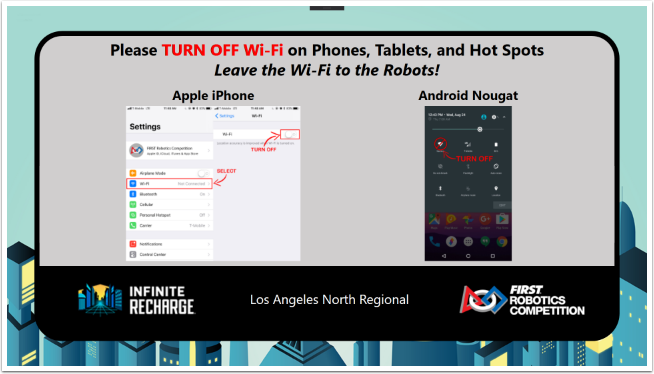
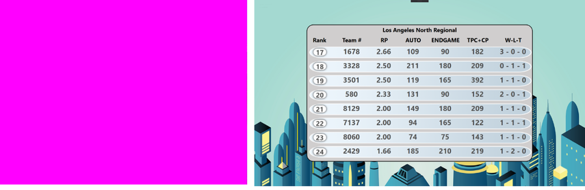
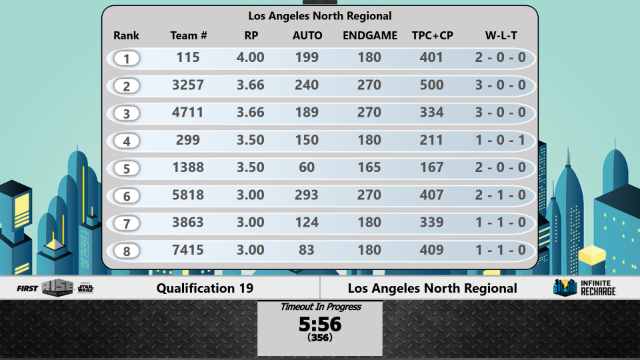

.. include:: <isonum.txt>

Ancillary
=========

Additional screens available for event use.

WiFi Reminder
-------------

The WiFi Reminder is an image that the Scorekeeper can show at the request of venue personnel (FTA, or related) in order to remind those in the venue to disable the WiFi on their Phones, Tablets, and Hot Spots. This carries a lot more "punch" and "weight" when announced by the Emcee in coordination with this image, which is why it is packaged along with the Audience Display instead of just packaged inside the mountains of slides that run within the venue.

Video Only
----------

The Video Only audience screen is used when it is desirable to overlay no scoring, time, or match information on the audience screen.

[Left] Full screen chroma for replacement with video or production information. Chroma color can be adjusted in `Settings <../../audience/l/558886-settings#>`_ .

[Right] Instead of chroma, display a full screen version of the current rankings (Qual) or bracket (Playoff). Mode depends on `Settings <../../audience/l/558886-settings#>`_ .

Background
----------

.. image:: images/ancillary-2.png
   :alt: Left: default Background containing the game logo and event name. Right: "Message" tab showing a configurable message.

The background screen contains the game logo for the season, and can be used during breaks, lunch, etc as an alternative to video overlay ("Video Only") or as a way to show the audience the game logo.

[Left] The default Background containing the game logo and event name.

[Right] Optionally, the "Message" tab (Match Play/Match Test) can be used to add a banner message to the bottom of the display, such as important event announcements, notification of breaks, etc. These messages will appear on all instances of Audience Display, remote or local.

Timeout
-------

The timeout display is available during both Qualification and Playoff matches, though is typically only used in Playoffs when back-to-back matches are necessary (or a Team calls a timeout). The display contains the match number or phase (e.g. "Test Match") as well as the event name and time remaining. Upon timer expiry/cancel, the "buzzer" sound will be played.

(Above) Traditional timeout display, with chroma available for video overlay.

If configured for Rankings (see `Settings <../../audience/l/558886-settings#>`_ ) instead of Chroma, the current rankings or bracket will be displayed in place of the Chroma.
