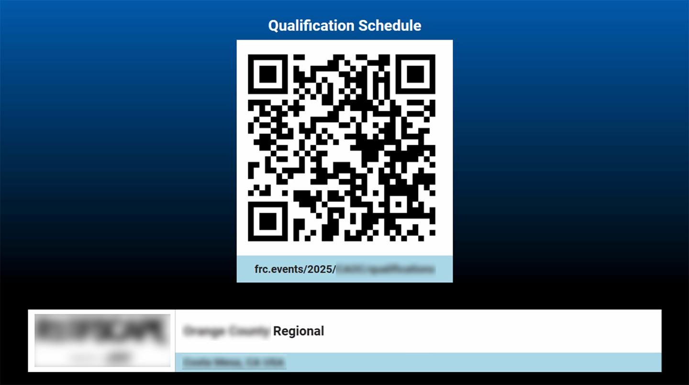
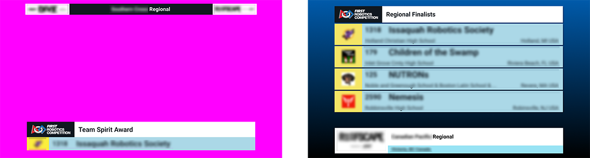

.. include:: <isonum.txt>
.. _audience-announcement:

Announcement
==================

Screens specifically designed to announce information to the audience.

In all examples below, the Fucshia pink color represents the "Chroma" and the color can be adjusted in the :ref:`Audience Display Settings <audience-settings>`.

Schedule
-------------

The schedule display shows a QR code and URL for the audience to navigate to the official event results.
This graphic is much more effective when accomanied by the Emcee in making an corresponding announcement.

WiFi Reminder
-------------

The WiFi Reminder is an image that the Scorekeeper can show at the request of venue personnel (usually the FTA) in order to remind those in the venue
to disable the WiFi on their phones, tablets, and hotspots. This graphic is much more effective when accomanied by the Emcee in making an announcement alongside
this image.

Award
----------------

The "Display Award" screen in the award assignment steps of the wizard put the name of the award and event up on the screen.

[*Left*] Chroma version of the award display

[*Right*] Fullscreen version of the award display

Award Assignment
----------------

The "Display Award Winner" screen in the award assignment steps of the wizard adds the award winning team or person to the existing award data on the screen.

[*Left*] Chroma version of the award display once the winner is revealed

[*Right*] Fullscreen version of the award display once the winner is revealed
