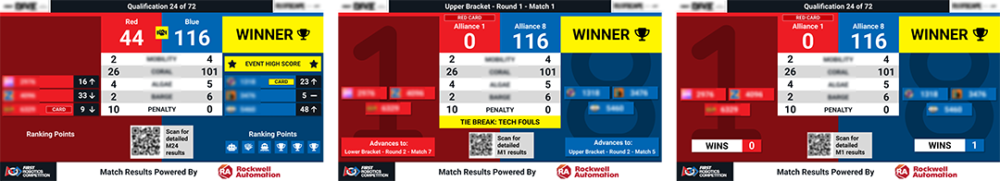

.. include:: <isonum.txt>
.. _audience-match-displays:

Match Displays
==============

The typical display flow within a match, from pre-match to post-match.

Video Only
-------------
For details see :ref:`the specialty tab <audience-specialty>`

Match Preview
-------------

The Match Preview screen displays team names and rankings for the teams scheduled to compete in the next match. The Match Preview is a mandatory screen in the
FCUI process and can even be selected again once the "Show Match Score Bar" button has been pressed until the Match is started.

[*Left*] Qualification Matches - Team rankings are displayed next to their team name and avatar

[*Middle*] Playoff Matches Rounds 1-4 - Alliance affiiation information is added to the display, alongside bracket progression tracking

[*Right*] Playoff Matches Round 5 (Finals) - The bracket progression tracking is replaced with "best of 3" progression

Video and Score
---------------

Video and Score is the most common display at an FRC competition. Event Name, match time, score and game-specific details are overlayed on the "bottom third" of the screen.
The *Match Under Review* icon is used to show that the Head Referee has marked the match for further review after completion- and indicated by a yellow message in the middle of the screen.
The event name will show on the top of the screen.

In Playoff matches, the Alliance number is displayed alongside the team numbers. The white box between the alliance scores will display the time remaining in the match and match phase (auto or teleop).

Traditionally, the Video and Score will have a space for chroma to add video or production data. If set to Rankings (see :ref:`Settings <audience-settings>`)
the chroma portion of the screen will be replaced with current rankings or, in the case of the Playoff tournament, the bracket.

Match Result
------------

Match results is used to show the audience the final scores of the match they just witnessed. Team numbers, cards issued to the teams in the match, their new ranking, and
how that rank changed from the team's previous match are shown. Also shown are the scoring details for the match, as well as the match outcome (which alliance is victorious).

A HIGH SCORE indicator if one or both of the teams broke the previous high score for the tournament (this is event specific, and checks both qual and playoff matches).

When the "Post Result" button is pressed to bring up this display, a short audio clip and video are played before the results are revealed.

In Playoff matches, an additional box indicates the next match in which the alliance will appear as a result of their performance (if applicable).
