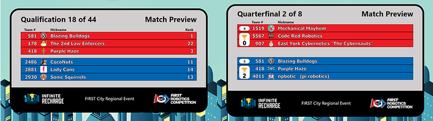

.. include:: <isonum.txt>

Match Flow
==========

The typical display flow within a match, from pre-match to post-match.

Match Preview
-------------

The Match Preview screen displays team names and rankings for the teams scheduled to compete in the next match. The Match Preview is a mandatory screen in the FCUI process and can even be selected again (it will turn YELLOW) once the “Set Audience Screen” button has been pressed until the Match is started.

[Qual] Team rankings are displayed next to their team name

[Playoff] Team rankings are replaced by a collective Alliance number next to the captain. Additionally, a small indicator is added below the alliance number to indicate the number of wins for the alliance.

Video and Score
---------------

.. image:: images/match-flow-1.png
   :alt: Video and Score screen. Has a lower third of current match information.

Video and Score is the audience display most typically used at an FRC\ |reg| competition. Event Name, match time, score, game-specific details such as Stage Progression and GENERATOR SWITCH state, and match number information overlayed on the "bottom third" of the screen. The *Match Under Review* icon is used to show that the Head Referee has marked the match for further review after completion- and indicated by a yellow referee icon appearing between the scores. If the event name is too long for the space provided, it will horizontally scroll to the right of the timer indicator.

Traditionally, the Video and Score will have a space for chroma to add video or production data. If set to Rankings (see `Settings <../../audience/l/558886-settings#>`_ ) the upper portion of the screen will be replaced with current rankings or the bracket (as shown above)

Match Result
------------

.. image:: images/match-flow-2.png
   :alt: Match Results screen. Left: red win. Right: blue win.

Match results is used to show the audience the final stats about the match they just witnessed. Teams, cards issued to the teams in the match, their new ranking, and how that rank changed are shown. Also shown are the scoring details for the match, as well as the match outcome (which alliance is victorious, or indicates a tied match). Also shown is a HIGH SCORE indicator if one or both of the teams broke the previous high score for the tournament (this is event specific, and counts on qual and playoff matches). It is accompanied by a short audio clip and the "background" screen prior to being displayed.
