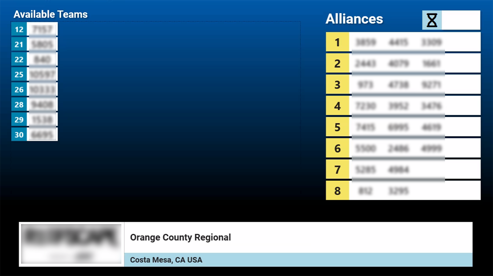
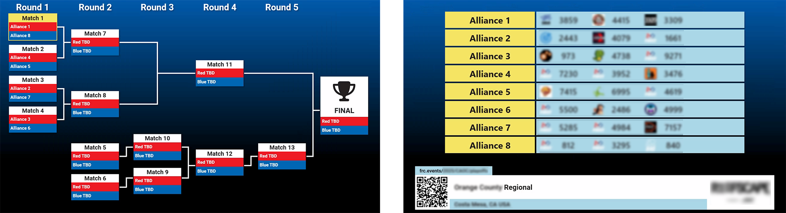

.. include:: <isonum.txt>
.. _audience-playoff-displays:

Playoff Displays
================

Screens available specifically for the Playoff process.

Alliance Selection
------------------

There are two versions of the Alliance Selection display. One supports the use of insert video, one does not. The preferred version, 
which supports insert video, is shown in the below photo. Depending on the "Show Chroma Box on Alliance Selection" setting the 
Chroma background may or may not be visible. 

.. image:: images/playoff-0.png
    :align: center

|
| The alternative version is a fullscreen display primarily for use at Off-Season events.

|
| Both displays serve the same purpose- guiding teams and the audience through the alliance selection process. 
| Views contain the alliances, which will populate with the team numbers of selected teams as entered by the Scorekeeper. 
| Teams available for selection are displayed in rank order on the left side of the screen.

During the Alliance Selection process there are scheduled breaks for alliances to discuss their strategy. During these breaks, 
a special display is used called the "Alliance Timer Bug" and can only be triggered from the Event Wizard. This display is 
specifically designed to fit the videos that the local production crew will run during these breaks.

Bracket
-------

The bracket display is used during the Playoff tournament to guide teams and the audience through the playoff tournament. 
It rotates between two views- the current bracket progression and the detail of alliance membership. This rotation is automatic 
and will repeat until a new display is triggered.

.. note::
   The bracket view is critical to keeping everyone in the venue aware of the progression through the playoffs- 
   please coordinate with the announcer/emcee to display the bracket at the conclusion of each match.

Break
-------

.. image:: images/playoff-3.png

The break timing display is available during both Qualification and Playoff matches, though is typically only used in Playoffs when between matches.
The display contains the match number or phase (e.g. "Test Match") as well as the event name, time remaining and upcoming match data.
Upon timer expiry/cancel, the "buzzer" sound will be played if "sound alerts" were enabled when the break was started by the scoring table.

Video can be inserted in the remaining space on the screen using Chroma, or, when the settings option for Rankings background is enabled the 
Qualificiton Rankings or Playoff Brack will be in the remaining space.

[*Left*] Qualification break

[*Right*] Playoff break
