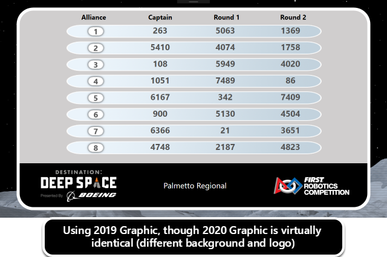
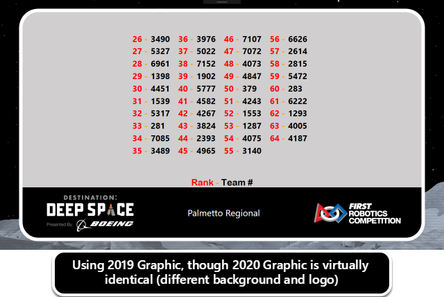
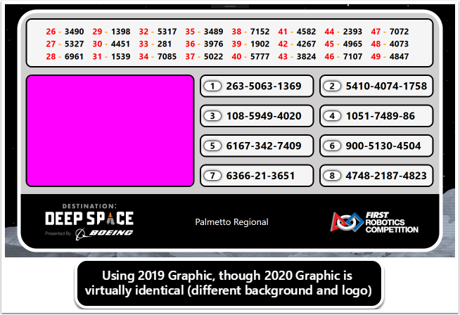

Playoff Specific
================

Screens available specifically for the Playoff process.

Alliance Selection
------------------

Used in conjunction with the "Available Teams" display to guide Teams and the Audience through the alliance selection process. It shows the captains and each of their picks, as entered by the scorekeeper. Teams appear on the display once the scorekeeper loses focus on the box containing their team number (see Alliance Selection).

Available Teams
---------------

Teams not yet selected during Alliance Selection are shown in the "Available Teams" display. Up to 70 teams are displayed in order of their Qualification rank. This display should be used in conjunction with the "Alliance Selection" view to assist Teams and the Audience in knowing who remains available for selection.

Hybrid
------

The Hybrid view is a combination view used to combine the Alliance Selection screen, Available Teams screen, AND a video chroma box so that this view can stay up without significantly impacting the video performance of the event.

Bracket
-------

The bracket display is used during the Playoff tournament to indicate standings of all alliances. It is useful to show the Audience when an alliance advances from one level of the tournament to the next (e.g. Quarterfinals to Semifinals). Until a phase is complete (i.e. Quarterfinals) the bracket will continue to show the active phase with alliance numbers filled in on the following phase as applicable.
