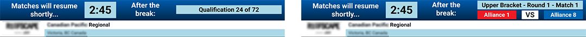

.. include:: <isonum.txt>
.. _audience-playoff-specific:

Playoff Specific
================

Screens available specifically for the Playoff process.

Alliance Selection
------------------

.. image:: images/playoff-1.png

Guide teams and the audience through the alliance selection process. Views contain the alliances, which will populate with the team numbers 
of selected teams as entered by the Scorekeeper. Teams available for selection are displayed in rank order in the top section of the screen.

[*Left*] Alliance selection view without "Chroma" for live camera feed

[*Right*] Alliance selection view with space for a live camera feed

Bracket
-------

.. image:: images/playoff-2.png

The bracket display is used during the Playoff tournament to guide teams and the audience through the playoff tournament.

.. note::
   The double elimintation bracket is new in 2023. The bracket view is critical to keeping everyone in the venue aware 
   of the progression through the playoffs- please coordinate with the announcer/emcee to display the bracket at the 
   conclusion of each match.

Break
-------

The break timing display is available during both Qualification and Playoff matches, though is typically only used in Playoffs when between matches.
The display contains the match number or phase (e.g. "Test Match") as well as the event name, time remaining and upcoming match data.
Upon timer expiry/cancel, the "buzzer" sound will be played if "sound alerts" were enabled when the break was started by the scoring table.

[*Left*] Traditional timing screen

[*Right*] Alternative timing screen when "Graphics Background" setting is "Rankings"
