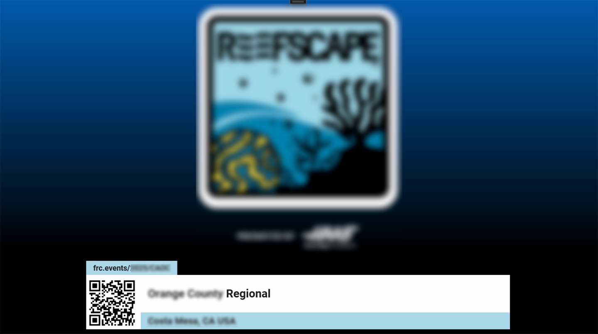

.. include:: <isonum.txt>
.. _audience-specialty:

Specialty Displays
==================

Additional screens available for event use.

In all examples below, the Fucshia pink color represents the "Chroma" and the color can be adjusted in the :ref:`Audience Display Settings <audience-settings>`.

Video Only
----------

The Video Only audience screen is used when it is desirable to overlay no scoring, time, or match information on the screen.

[*Left*] Traditional Video Only screen

[*Right*] Alternative Video Only screen when "Graphics Background" setting is "Rankings"

Background
----------

|
| The background screen contains the game logo, and can be used during breaks or lunch as an alternative to video overlay ("Video Only") or as a
| way to show the audience the game logo or a custom message (see below).

Message
----------

|
| A custom message can been displayed using the "Message" tab in :ref:`Match Test/Play <match-play-tabs>` 

Qual Rank
----------

.. image:: images/specialty-3.png
    :align: center
    :width: 550

|
| Display and scroll through the current rankings. In order for a team to appear in the list, they must have played at least one qualification match.
