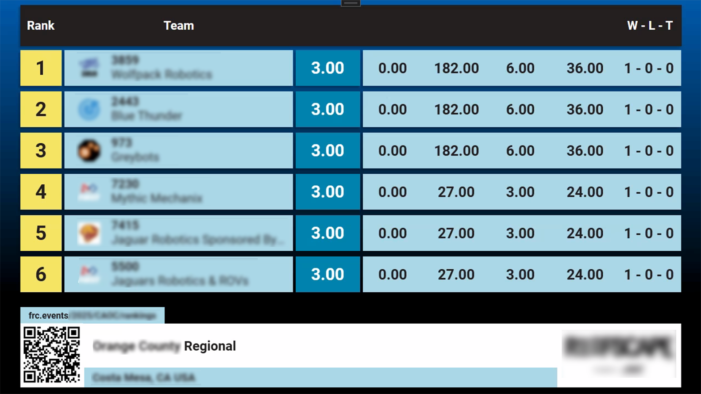

.. include:: <isonum.txt>
.. _audience-specialty:

Specialty
=========

Additional screens available for event use.

In all examples below, the Fucshia pink color represents the "Chroma" and the color can be adjusted in the :ref:`Audience Display Settings <audience-settings>`.

WiFi Reminder
-------------

.. image:: images/specialty-1.png

The WiFi Reminder is an image that the Scorekeeper can show at the request of venue personnel (usually the FTA) in order to remind those in the venue
to disable the WiFi on their phones, tablets, and hotspots. This graphic is much more effective when accomanied by the Emcee in making an announcement alongside
this image.

Video Only
----------

.. image:: images/specialty-2.png

The Video Only audience screen is used when it is desirable to overlay no scoring, time, or match information on the screen.

[*Left*] Traditional Video Only screen

[*Right*] Alternative Video Only screen when "Graphics Background" setting is "Rankings"

Background
----------

The background screen contains the game logo, and can be used during breaks or lunch as an alternative to video overlay ("Video Only") or as a
way to show the audience the game logo or a custom message.

[*Left*] Traditional Background screen

[*Right*] Background screen when a custom message has been displayed using the "Message" tab in :ref:`Match Test/Play <match-play-tabs>`

Award
----------------

The "Display Award" screen in the award assignment steps of the wizard put the name of the award and event up on the screen.

[*Left*] Alternate version of the award display with chroma

[*Right*] Full screen version of the award display

Award Assignment
----------------

The "Display Award Winner" screen in the award assignment steps of the wizard adds the award winning team or person to the existing award data on the screen.

[*Left*] Alternate version of the award display with chroma

[*Right*] Full screen version of the award display

Qual Rank
----------

Display and scroll through the current rankings. In order for a team to appear in the list, they must have played at least one qualification match.
