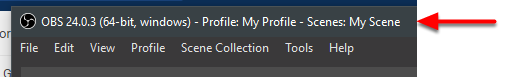
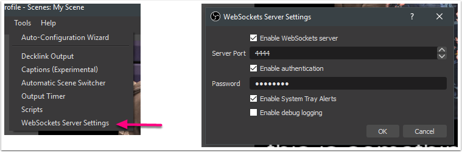
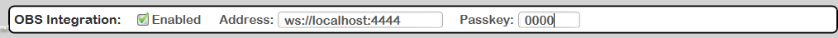
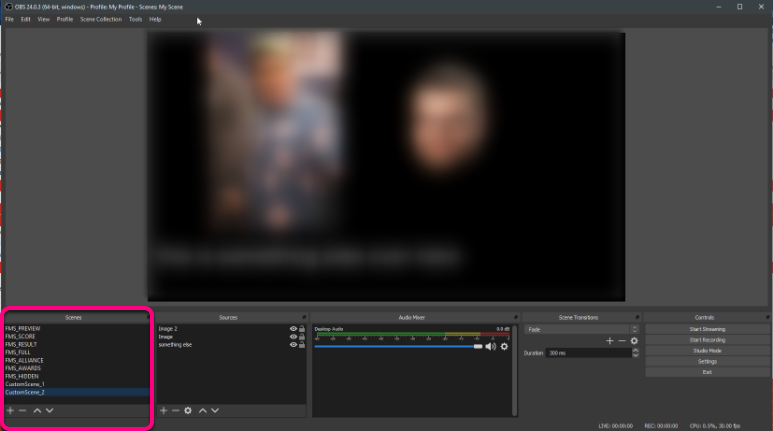

OBS Websockets
==============

OBS Integration must be configured through the settings tab, and is considered an advanced feature. We recommend only using this feature after coordination with FRC Event Support!

OBS Websockets / OBS Integration allows you to control your video feed (for use on a webstream, or potentially on a scoreboard at off-season events) via the free OBS Software and use of the FIRST FMS Audience Display by automatically changing what the audience is seeing based on what is happening at the event, without the need for an operator. To do so, configure the two required programs as outlined below.

Setup and Installation - OBS
----------------------------

#. Install the desired version of OBS, a free open-source video streaming platform from their website at: `https://obsproject.com <https://obsproject.com>`_ Make sure to install version 24 or newer to use the OBS Integration feature!#. Install the obs-websocket Plugin for your version of OBS. Download for free from: `https://github.com/Palakis/obs-websocket/releases <https://github.com/Palakis/obs-websocket/releases>`_ (select the Windows EXE installer for easiest experience)#. Run OBS and configure the desired scenes based on the below directions in the "OBS Scenes" section.#. *Only after configuring the Scenes* , open the Websockets Config panel in OBS as shown below: Make sure the Server Port is 4444 (or, if changing the default, note the selection for configuring the Audience Display) Make sure the Enable authentication checkbox is on, and select a 4-digit code to encrypt the traffic. It is recommended to keep System Tray Alerts on to see notifications if any connections are lost* Make sure the Server Port is 4444 (or, if changing the default, note the selection for configuring the Audience Display)* Make sure the Enable authentication checkbox is on, and select a 4-digit code to encrypt the traffic.* It is recommended to keep System Tray Alerts on to see notifications if any connections are lost

Start the Websocket server by checking Enable (green arrow) and selecting OK to close the menuOBS should now be fully configured. Move on the configuring FMS Audience Display as outlined below.

.. image:: images/obs-websockets-2.png

OBS Scene Configuration
-----------------------

.. image:: images/obs-websockets-5.png

The OBS Integration will tell the Audience Display to change scenes in OBS automatically as the match and event progress. In order to do so, it relies on Scenes to be named exactly as specified in this documentation. Using the Scenes area (marked above in pink) create the Scenes you are interested in using, detailed below. NOTE: Two scenes minimum are required: FMS_FULL and FMS_HIDDEN at bare minimum for any operation to take place.

* FMS_PREVIEW: Configure this scene for your desired output during Match Preview.* FMS_SCORE: Configure this scene for your desired output during Match Play. It must, at minimum, show the score bar generated by FMS without any modification from how it is provided by FIRST. It should contain a Chroma filter to remove the portions intended to be keyed out.* FMS_RESULT: Configure this scene for your desired output during the Post Result after a match. At minimum, it should show the animation that plays when scores are being revealed, and the score detail as provided by the FIRST Audience Display.* FMS_FULL: This scene is required! It is used in place of any scene that is not implemented from the rest of this list. It should be configured for the desired output when a full-screen display is showing from FMS, such as the messages generated by the scorekeeper. It should contain a Chroma filter to remove the portions intended to be keyed out.* FMS_ALLIANCE: Configure this output to the desired look during the Alliance selection process. It should contain a Chroma filter to remove the portions intended to be keyed out. Some versions of the audience display contain boxes that are meant to be keyed out in favor of a camera look. Not all displays will have a chroma element to remove.* FMS_AWARDS: Use this scene for the output during Award Ceremonies. It should accommodate the lower third bar that shows the award being presented and the winning team or person. It should contain a Chroma filter to remove the portions intended to be keyed out.* FMS_HIDDEN: This scene is required! This scene is used whenever the FMS Audience Display is not supposed to be seen, or has finished showing data. For instance, after showing match preview for enough time for users to read it, FMS will transition to this scene to hide the display. This can be made up of cameras or other graphics that are not from the Audience Display output.

Note that adding additional scenes beyond those listed is also fine. In the above example Scenes "CustomScene_X" have been added. These scenes can be used at other times during the event, but remember that with the integration enabled, it will return to the "FMS_" scenes on the next Audience Display trigger.

Don't forget to configure the Audio the desired way in each scene, or globally!

Accessing Settings - Audience
-----------------------------

.. image:: images/obs-websockets-6.png

DO NOT ENABLE THIS FEATURE WITHOUT HAVING WEBSOCKETS ENABLED IN THE OBS SOFTWARE, OR MATCH PLAY MAY BE IMPACTED!

Look for the OBS Integration options in the settings tab to enable the feature. Only enable the feature after enabling Websockets in the OBS software. The default address should be sufficient for most use cases, and should contain the address (starting with WS) and including the port number (default of 4444). Select a passkey (consisting of 4 digits) to encrypt your connection.

There are no other settings to change in the Audience Display.

