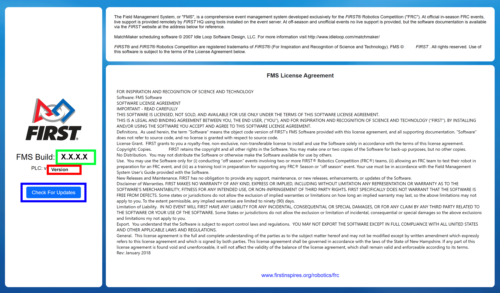

.. _about-tab:

About Tab
===========

The "About" tab contains version information and software notices. 2023 versions of FMS will always have a Major Version of "10".

[Green] Build (revision) of the software currently installed

[Red] Build (revision) of the PLC software currently installed (not applicable in Off-Season builds)

[Blue] For traditional versions of FMS, check for available updated versions and initiate the install process

[Green] Current software license, which was agreed to upon installation of the software

There is no built in update capability in the Off-Season version of the software. In the traditional version, once an update download has been initiated, download progress statistics will be displayed and the installation process will begin automatically.
