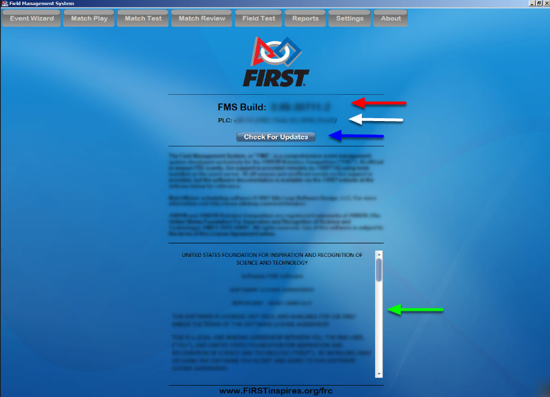

About Tab
=========

About
-----

The "About" tab contains version information and software notices. 2020 versions of FMS will always have a Major revision of "7".

[Red] Build (revision) of the software currently installed

[White] Build (revision) of the PLC software currently installed. Current build should begin with v31.11 (Not applicable in Off-Season builds)

[Blue] For traditional versions of FMS, check for available updated versions and initiate the install process

[Green] Current software license, which was agreed to upon installation of the software

In the traditional (non Off-Season) version of the software, once an update download has been initiated, the "Check for Update" button will be replaced with download progress statistics.

