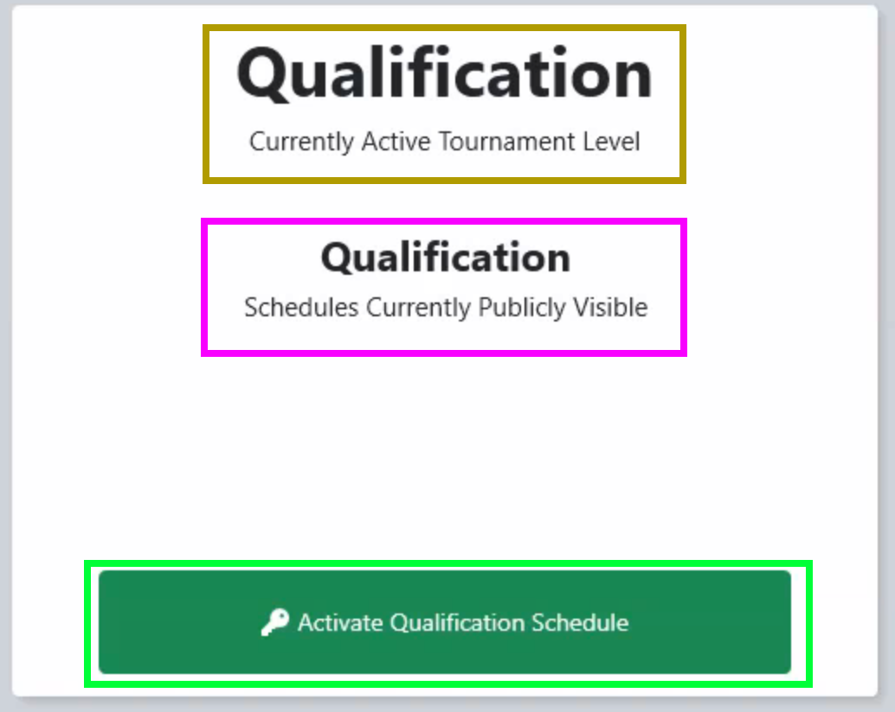

.. _event-wizard-activate-schedule:

Activate Schedule
======================

After the schedule has been generated and alliances defined, the schedule must be activated in order to use Match Play or appear on the web.

[*Gold Box*] The currently active level in Match Play

[*Pink Box*] All levels that are publicly visible

[*Green Box*] Used to make the schedule available for Match Play and available for viewing on the FIRST website and API (the schedule does not sync in FMS Off-Season or when disabled)

Database Backup
###############

The software does incremental backups stored on the local hard drive and USB drive (if so indicated in Settings >> Backup Config) throughout the tournament, but it's also important to do a complete backup at the end of each stage as well.

Full backups of the event database can be made in the :ref:`settings-backup`

.. note::
    Backups never hurt- and can be done as often as requested.