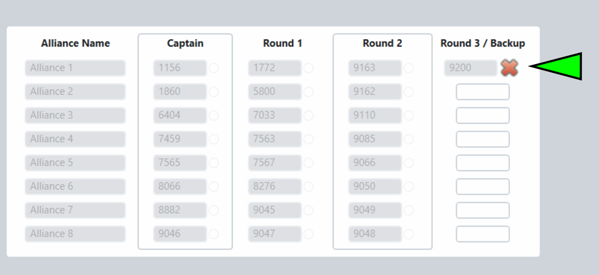

.. _event-wizard-alliance-membership:

Alliance Membership
======================

Substitution
############

Playoff rules stipulate that if any member of an alliance becomes unable or unwilling to continue playing through the tournament, the alliance captain may adopt the next highest-ranking
team not selected during Alliance Selection process to act as a Backup Robot. The alliance membership wizard step is used to assign the backup robot into an alliance.

[*Pink Box*] Type the incoming team number into the corresponding row for the alliance they are joining

[*Green Box*] The list of available team eligible to come into the playoff tournament. This list should be compared to the teams on the "Backup Team List" report and discussed with the Head Referee to select the correct team to bring into the tournament- it is not up to the choice of the alliance.

Click the green Save button to initiate the swap. This will add the incoming team into the schedule in place of the outgoing team for all matches which have not yet been played.

Un-doing Substitution
#####################

If a substitution is made by accident it can be undone. Though it is possible to undo, it can add confusion to field staff and audience members. Scorekeepers should be double checking
before entering backup robots. 

[*Green Marker*] Click the red "X" next to the backup robot to remove it. The software will confirm that you want to undo the backup robot and requires a password before completing the process.

A backup robot cannot be removed once it has played in a match.
