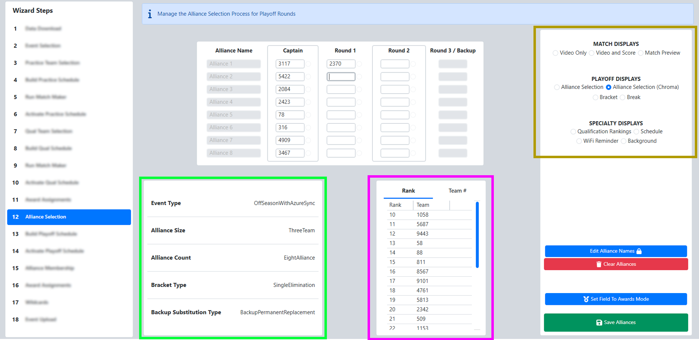

.. _event-wizard-alliance-selection:

Alliance Selection
======================

[*Green Box*] At all official FRC Events, the 8-alliance tournament is used, but smaller Off-Season events may use other formats.
The current settings, as picked on the Event Selection step, are displayed.

[*Pink Box*] The list of available teams for selection is shown and can be viewed sorted by Rank (default) or by team number (the "Team #" tab).

[*Gold Box*] Use the Audience Video Control panel to manipulate the Audience Display(s)

The Scorekeeper populates the team numbers into the table on the center of the page. If a number is entered that is not in the available team list, an icon will appear in the upper left
corner of the text box (and hover text will indicate the error). If a team number is entered twice, the newest entry takes priority and the old location is changed to blank.

If an alliance captain is selected in a Round 1 pick, the captains from lower ranked alliances will be promoted automatically. If a team number is deleted, they're re-added
to the available teams box.

Once the selection process is complete, select "Save" and move on to the next step of the Wizard.
