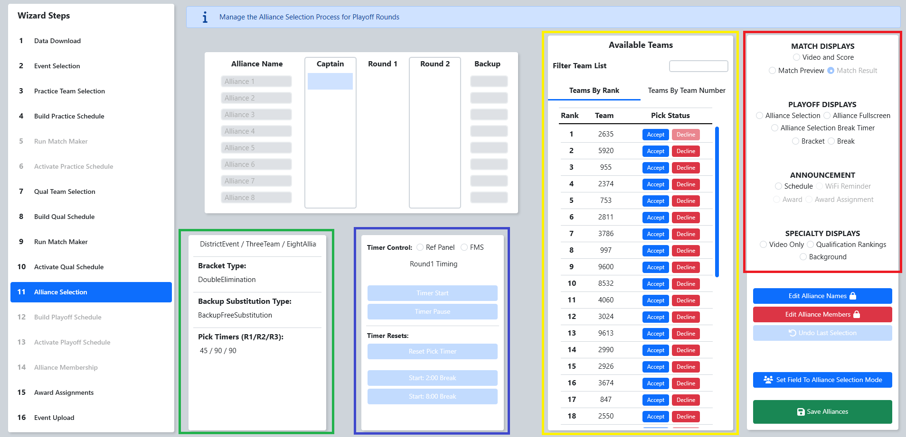
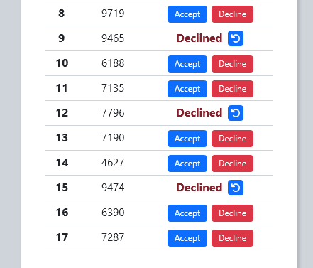
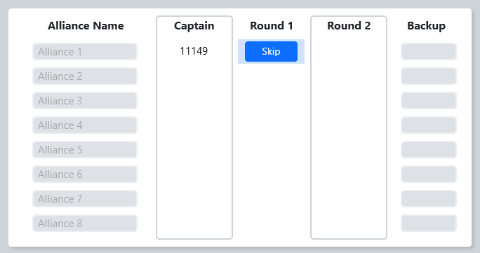
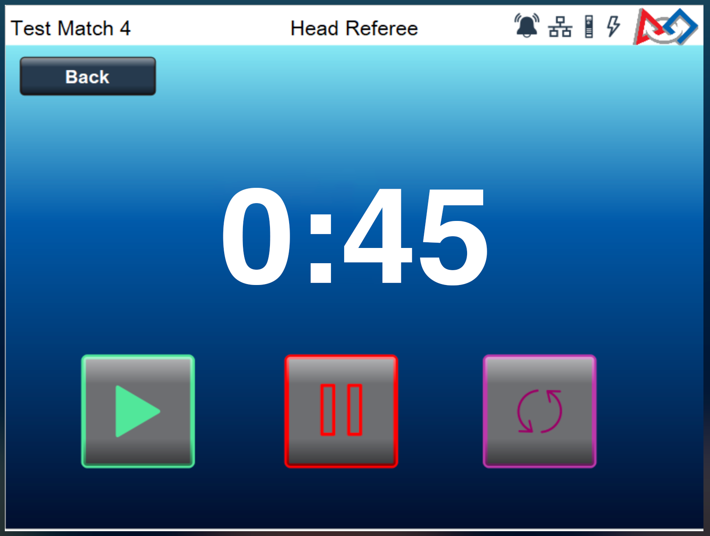
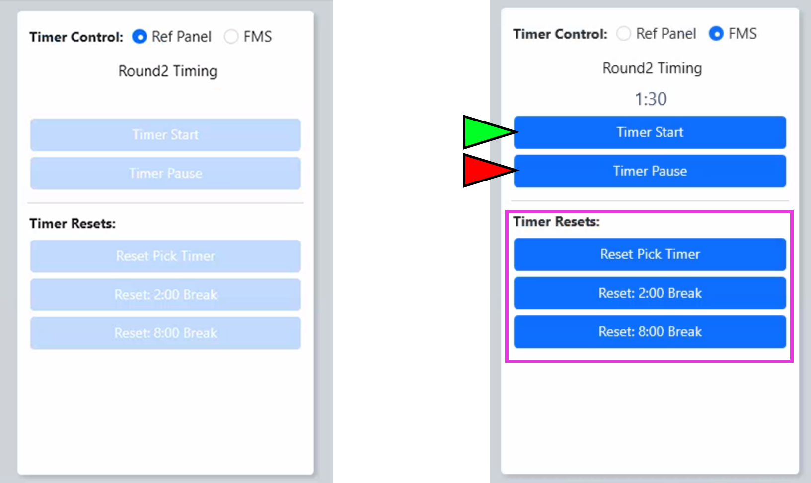

.. _event-wizard-alliance-selection:

Alliance Selection
======================

[**Green Box**] Settings for the Alliance Selection and Playoff Tournament. At all official FRC Events the 8-alliance tournament is used, 
but smaller Off-Season events may elect other formats. The current settings (as picked/downloaded on the Event Selection step) are displayed.

[**Blue Box**] Timing controls for the Alliance Selection "Pick Timer" - outlined in more detail below

[**Yellow Box**] The list of available teams for selection is shown and can be viewed sorted by Rank (default) or by team number (the "Teams by Team Number" tab), along with an "Accept" or "Decline" button on each team.

[**Red Box**] Use the Audience Video Control panel to manipulate the Audience Display(s)

The Scorekeeper populates the team numbers into the table on the center of the page by clicking the "Accept" button on the team to be populated. The current alliance spot that will be populated by clicking the "Accept" button is highlighted in blue. In the screenshot above, the current alliance spot to be filled is Alliance 1 Captain.

.. note::
    The "Accept" button on a team should only be clicked once they are guaranteed into that position (either because they accepted an invitation or because they're the captain of the alliance making the next selection).
    This means that at the beginning of the Alliance Selection process, only the Alliance #1 captain should be entered.

| 
| If a team declines a pick into an alliance, click the "Decline" button on that team. The team will then have a strikethrough on the Audience Display, unless they are a potential captain. The Accept and Decline buttons will go away for that team, replaced with red text saying "Declined" and a blue undo button. Clicking the blue undo button will undo the decline for that team and they will become available to be picked again.

.. note::
    If you click decline on a team that will then need to be put into a captain slot later, FMS will automatically undo the decline when they become the highest ranked available team and the next slot to fill is captain to allow you to click "Accept" and put them in that captain slot.

| 
| On all alliance member spots except for Captain, there will be a blue "Skip" button in addition to the blue box when that spot is the current spot to be filled. In the case of an alliance not making a pick in time, that alliance smember slot must be skipped until the end of the current round. In order to do this, click the "Skip" button on the alliance member slot.

.. note::
    If a mistake was made (wrong team accepted into an alliance or alliance member slot skipped when it shouldn't be), click the "Undo Last Selection" button on the bottom right side of the screen. This will undo the last team accepted into an alliance or the last alliance member slot that was skipped, in reverse order of how they ocurred.

Once the selection process is complete, click "Save Alliances" and move on to the next step of the Wizard.

Pick Timer
#################################

.. warning::
    The official timing and rules for the "Pick Timer" in Alliance Selection is outlined in the Tournament section (section 10) of the official Game Manual.

By default the Pick Timer is controlled by the FTA via the Head Referee panel (shown below), in which case the software controls will be disabled (shown on the left). 
In off-season events or when the hardware is unavailable, selecting "FMS" Timer Control will enable the software control buttons. 

| 
| The buttons in the Head Referee panel directly mirror the FMS interface:

* The green "Play" button is the "Timer Start" button
* The red "Pause" button is the "Timer Pause" button
* The purple "Reset" button is the "Reset Pick Timer" button in the top of the green box
    

The Reset button will automatically reset to the correct time based on which round of selections are in progress. 
Under normal operation, the Scorekeeper focuses on entering the Captain and selected team numbers into FMS while the 
FTA (or their designee) focuses on managing the Pick Timer.

The Scorekeeper starts and stops the timer during the scheduled breaks, which happen between the last Qualification match and the 
start of the Alliance Selection process as well as between each "round" of Alliance Selection. The can be started using the 2:00 
and 8:00 buttons in the interface.
