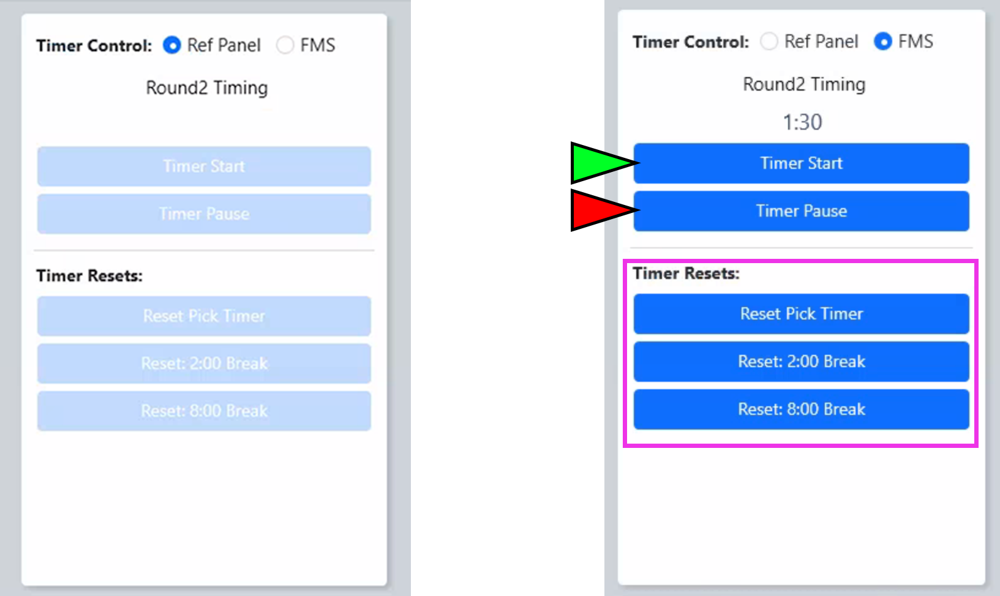

.. _event-wizard-alliance-selection:

Alliance Selection
======================

.. image:: images/alliance-selection-1.png

[*Green Box*] Settings for the Alliance Selection and Playoff Tournament. At all official FRC Events the 8-alliance tournament is used, 
but smaller Off-Season events may elect other formats. The current settings (as picked/downloaded on the Event Selection step) are displayed.

[*Blue Box*] Timing controls for the Alliance Selection "Pick Timer" - outlined in more detail below

[*Pink Box*] The list of available teams for selection is shown and can be viewed sorted by Rank (default) or by team number (the "Team #" tab).

[*Gold Box*] Use the Audience Video Control panel to manipulate the Audience Display(s)

The Scorekeeper populates the team numbers into the table on the center of the page. If a number is entered that is not in the available team list, an icon will appear in the upper left
corner of the text box (and hover text will indicate the error). If a team number is entered twice, the newest entry takes priority and the old location is changed to blank.

If a team number is deleted, they're re-added to the available teams box. A team is only shown on the Audience Display (and removed from Available Teams) once focus is changed away from that team (such as tabbing out).

.. note::
    A team number should only be entered once they are guaranteed into that position (either because they accepted an invitation or because they're the captain of the alliance making the next selection).
    This means that at the beginning of the Alliance Selection process, only the Alliance #1 captain should be entered.

Once the selection process is complete, select "Save" and move on to the next step of the Wizard.

Pick Timer
#################################

.. warning::
    The official timing and rules for the "Pick Timer" in Alliance Selection is outlined in the Tournament section (section 10) of the official Game Manual.

By default the Pick Timer is controlled by the FTA via the Head Referee panel (shown below), in which case the software controls will be disabled (shown on the left). 
In off-season events or when the hardware is unavailable, selecting "FMS" Timer Control will enable the software control buttons. 

| 
| The buttons in the Head Referee panel directly mirror the FMS interface:

* The green "Play" button is the "Timer Start" button
* The red "Pause" button is the "Timer Pause" button
* The purple "Reset" button is the "Reset Pick Timer" button in the top of the green box
    

The Reset button will automatically reset to the correct time based on which round of selections are in progress. 
Under normal operation, the Scorekeeper focuses on entering the Captain and selected team numbers into FMS while the 
FTA (or their designee) focuses on managing the Pick Timer.

The Scorekeeper starts and stops the timer during the scheduled breaks, which happen between the last Qualification match and the 
start of the Alliance Selection process as well as between each "round" of Alliance Selection. The can be started using the 2:00 
and 8:00 buttons in the interface.
