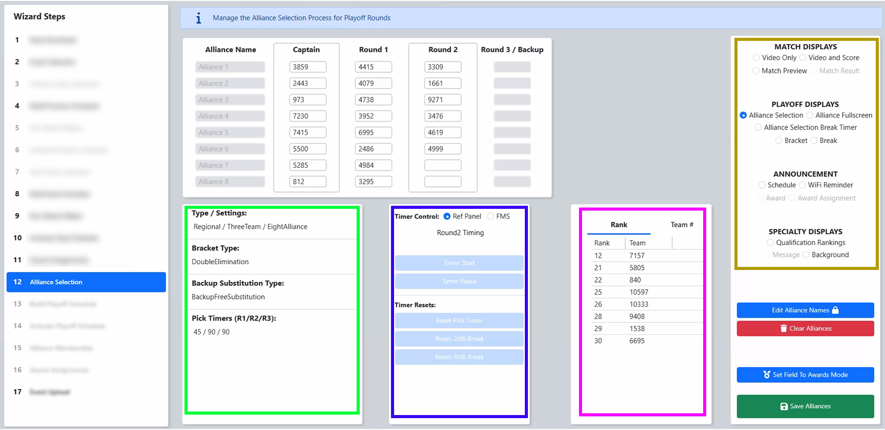

.. _event-wizard-alliance-selection:

Alliance Selection
======================

[Red] At all official FRC Events, the 8-alliance tournament is used, but smaller Off-Season events may use a 4-alliance playoff tournament. The current settings, as picked on the Event Selection step, are shown on the top of the screen.

[Blue] The list of available teams for selection is shown in the display box on the right hand side of the screen. As teams are selected from the pool of available teams, the corresponding team number is removed from the list of available teams. The list can be viewed sorted by Rank (default) or by team number (the "Team #" tab), and can be selected using the tabs shown by the blue arrow.

[Green] Use the Audience Video Control panel to select the Alliance (Pairing) screen to display to the audience. This can be used in conjunction with the Available Teams screen to inform the audience (and picking team) of which other teams remain available.

[Pink] The Scorekeeper populates the team numbers into this table. If a number is entered that is not in the available team list, an icon will appear in the upper left corner of the text box (and hover text will indicate the error). If a team number is entered twice, the newest entry takes priority and the old location is changed to blank. If an alliance captain is selected in a Round 1 pick, the captains from lower ranked alliances will be promoted automatically. If a team number is deleted, they're re-added to the available teams box.

Once the selection process is complete, select "Save" and move on to the next step of the Wizard.