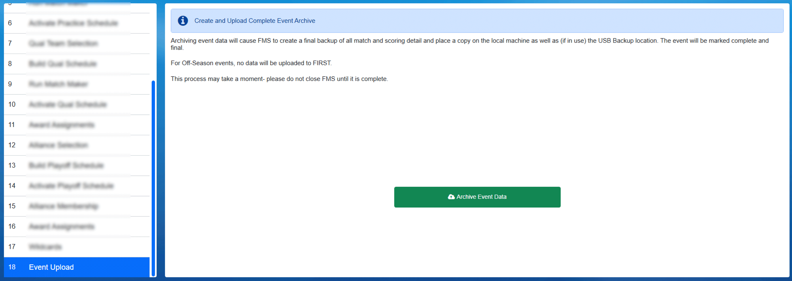

.. _event-wizard-archive-upload:

Archive and Upload
======================

The Event Data Upload step is used to do a complete backup of all event information. Copies are placed on the Event Server, USB drive (which must be connected),
as well as uploaded to FIRST (provided an Internet connection is available and the event is an official FIRST event).
Verification is also done to confirm the upload was successful.

**DEPENDING ON THE SIZE OF THE DATABASE, THE AMOUNT OF LOG DATA STORED, AND THE SPEED OF THE INTERNET CONNECTION AT THE EVENT THIS STEP MAY TAKE UP TO 10 MINUTES!**

Status information will be shown during the Upload.

If the upload fails, be sure to check the backup settings in the Settings >> Backup Config page and force a manual event backup.
The backup is what is used to upload, so if you find there are problems performing a manual backup this is the best place to start debugging:

* Ensure that the backup location is still present (the USB drive, in most cases)
* Ensure the backup location is set
* Ensure the backup has been performed (check the file is on the disk and there is sufficient space)
  
Performing a forced event backup will cause the backup to be generated, and the upload may be re-attempted by returning to the archive and upload step.

.. warning::
    Contact FRC Engineering before shutting down the server at the event, or if uploads are unsuccessful.
