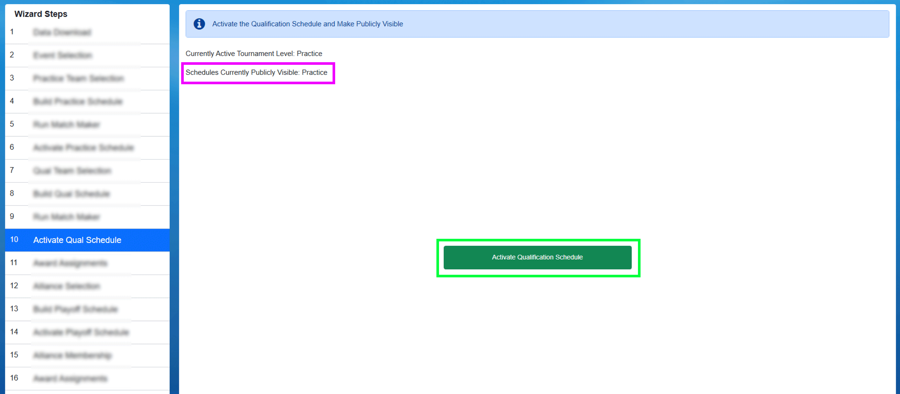

Award Assignments
=================

After the match schedule has been generated and alliances defined, it must be activated in order to play Matches or appear on the web.

[Blue Arrow] Clicking the Activate Practice Schedule button will make the schedule available for Match Play and available for viewing on the FIRST website (the schedule does not sync in FMS Off-Season or when disabled)

[Red Arrow] The currently active tournament level, and all levels that are publicly visible, are displayed on the step.

Database Backup
###############

Typically, after a tournament has been made active, the user will go to Match Play and play through the match schedule. The FMS software does incremental backups stored on the local hard drive and USB drive (if so indicated in Settings->Backup Config) throughout the Tournament, but it’s also important to do a complete backup at the end of each stage as well.

Full backups of the event database can be made by opening Match Play or Match Test and using the Force Event Database Backup button available on the Options tab in Match Play. Backups never hurt- and can be done as often as requested.