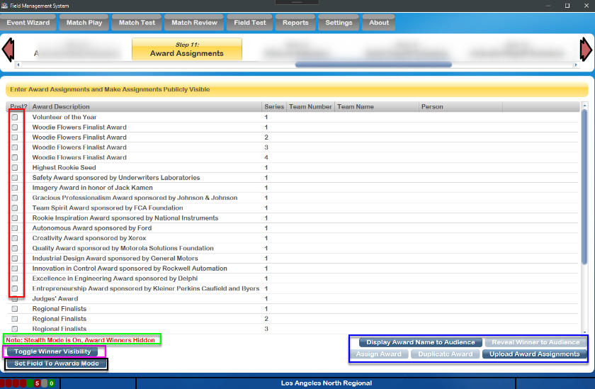
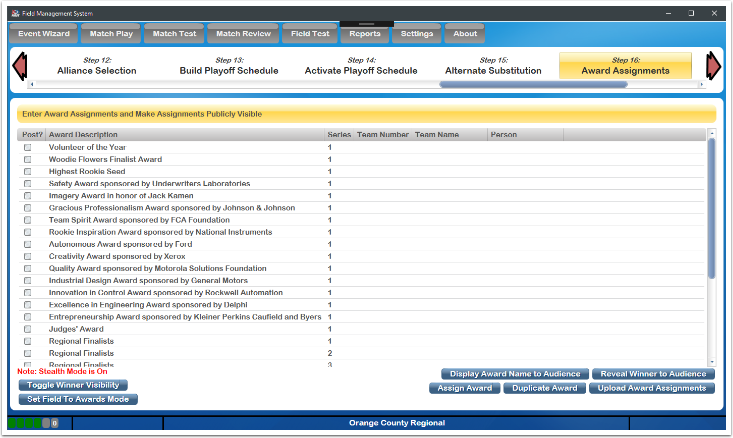
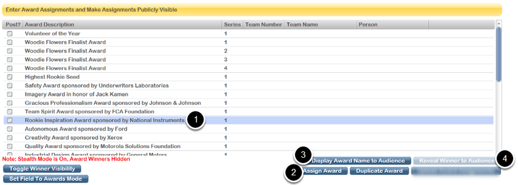
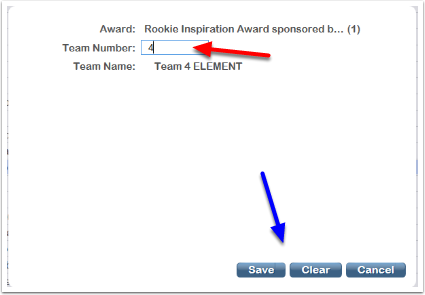
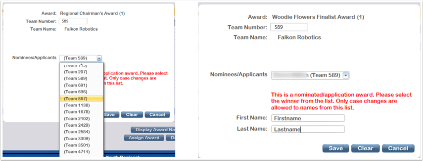

.. _event-wizard-award-assignment:

Award Assignments
======================

[Red] In order for an award to be visible on the web through the FIRST website, it must be marked as "Post" using the checkbox in that award's row.

[Green] Indicates whether or not stealth mode is on, see below for more information.

[Black] Using the Set Field to Awards Mode button the lights and team signs can be changed in the arena to a more universal look that's ready for the awards ceremony.

[Pink] Use the Toggle Winner Visibility button to enter or leave "Stealth Mode", as described below.

[Blue] Control buttons used to manage the award presentation process, as described below.

After all awards for the day (or the event) have been presented, use the Upload Award Assignments button to send those assignments (if marked with Post) to the FIRST website.

Stealth Mode
###############

When stealth mode is enabled the data in "Team Number", "Team Name" and "Person" fields is hidden, and a message is added on the bottom left. This data remains hidden until the button is toggled again. The data can be viewed once again by toggling the stealth mode off using the "toggle winner visibility" button. Note that stealth mode is on by default when the award page is loaded, and would need to be manually toggled off.

Present an Award
################

To assign an award:

(1, top photo) Click on an Award to present (the background of the row will turn blue)

(2, top photo) Click Assign Award button to enter the winning team information

(Red, bottom photo) Type the team number of the winning team, and the team name will appear below as the team number is typed. If the award is presented to a team that's not competing (such as at District Championships) the number will show a red triangle "error" indicator, meaning the team did not compete at the event. This can be bypassed later to still assign the award.

(Blue, bottom photo) After a team and/or person has been entered, the Save button commits this change. Cancel ignores the edits, Clear removes the award winner.

(3, top photo) The Display Award Name to Audience button displays a "frame" on the Audience Display informing them which award is being presented.

(4, top photo) ONLY AFTER THE EMCEE HAS ANNOUNCED THE WINNING TEAM NUMBER The Reveal Winner to Audience button displays the winning team's number and name to the Audience. See Audience Screen for examples of what these screens look like.

In normal operation, this process is not done by following these steps for each award, but rather in batches. For example, the scorekeeper enters all award winners in one pass, then, comes through again to show each award to the audience as they're read by the emcee. See the scorekeeper step-by-step for more information.

For award presented to individuals, such as Volunteer of the Year, a person first/last name box is offered on the award assignment screen as shown below.

Award Assignment from Application
#################################

Some award require the winning team/person to have previously applied or been nominated, such as the Woodie Flower's Award. In these cases, when the assigning the award in FMS, a drop-down list of potential winners will be offered. The winning team should be included on the list, and selecting them will populate the corresponding data on the assignment screen. Select save to commit the change, as with other awards. For awards where nominees are a specific person, from a specific team, the person first and last name fields additionally appear as shown below to the right. Selecting the winner from the dropdown completes all necessary corresponding fields.

Award Assignment Confirmation Messages
######################################

When a team number is entered on the Assign Award dialogue, there are potential confirmation messages that can be presented.

Upon each award assignment, the assignment is compared against an eligibility algorithm for the given team to determine if they qualify for that award. If an attempt is made to assign an award to an ineligible team, a message is presented and requires confirmation. Consult with the Judge Advisor for additional information.

Award Assignment Notes
######################

If more than one instance of an award is being presented, but not enough instance are showing in the available awards list, a duplicate can be made. For example, if two Judges' Awards are presented, click on the Judges' Award and press the Duplicate Award button on the bottom of the screen. A second instance (with "Series" 2) will be created and available for assignment.

FMS Off-Season does not support award distribution, and as such all buttons will be “grayed out” on the two award assignment wizard steps.