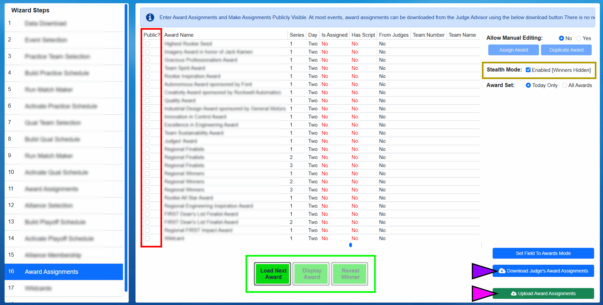
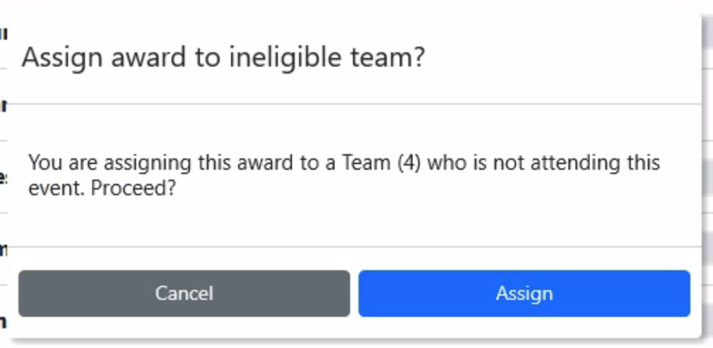

.. _event-wizard-award-assignment:

Award Assignments
======================

Under normal circumstances, award winners are downloaded by the Scorekeeper using the process outlined below.

[*Green Box*] If awards could not be downloaded, or an adjustment needs to be made, manual editing must be enabled. This requires authorization of the FTA and should only be used as a last resort.

There are two Award Assignment steps in the Event Wizard- both function identically. The first Award Assignment step is intended for use at the end of day 1, and by default displays only day 1 awards.
The second Award Assignment step is intende for use at the end of day 2, and by default displays only day 2 awards.

[*Pink Box*] Toggle the visible award set. This is especially useful when an award is being presented from the other award set, as toggling the visible set avoids having to switch back and forth between wizard steps.

Assignment Interface
####################

[*Red Box*] In order for an award to be visible on the web through the FIRST website, it must be marked as "Public" using the checkbox in that award's row.

[*Gold Box*] Indicates whether or not stealth mode is on, see below for more information.

[*Black Marker*] Using the Set Field to Awards Mode button the lights and team signs can be changed in the arena to a more universal look that's ready for the awards ceremony.

[*Purple Marker*] Download the Award Assignments from the Judge's system.

[*Green Box*] Control buttons used to manage the award presentation process, as described below.

[*Pink Marker*] Used to Upload Award Assignments marked "Public" to the FIRST website after all awards for the day (or the event) have been presented

Stealth Mode
###############

.. image:: images/awards-3.png

When stealth mode is enabled, the data in "Team Number", "Team Name" and "Person" fields are hidden. This data remains hidden until the stealth mode is disabled.
Stealth mode is on by default when the page is loaded, and whether it is on or off has no impact on the ability to use the presentation process.

Assignment Download
####################

At official events, Judge Advisors use the "Award Entry System" to submit the winners of various awards from the Judge's room throughout the event. Once they're done 
with assignments for a given day, they'll "release" those assignments to the Scorekeeper.

*Judges' Entry System*

When assignments have been released, a message will be posted to the Slack channel on the FMS Computer at the event to let the Scorekeeper know that assignments are available for download.

After assignments are downloaded, the "Is Assigned" and "Has Script" fields should change to "Yes" to reflect that they were successfully downloaded, along with "Yes" appearing in the "From Judges" column.
The "Is Assigned" field will still change to "Yes" if an award was assigned manually.

.. note::
    Not all awards have an associated script, so it is possible that "Has Script" may remain a "No" even after a successful download of an award. For example, the Dean's List awards do not have scripts.

.. warning::
    Manual award assignments should not be used without consulting FIRST HQ and/or the FTA. If the download process fails, contact your event support staff.

Present an Award
################

This process assumes all awards have been downloaded or manually entered before the start of the awards ceremony.

.. note::
    Some awards may be presented during the Playoff tournament, between matches. Scorekeepers will need to go back and forth from the Event Wizard to Match Play to facilitate this process.

[*Pink Marker*] Load an award to present either by clicking on it, or by clicking "Load Next Award" to load the next award that FMS believes should be presented.

[*Blue Marker*] The loaded award will be shown with the blue highlighted background

[*Pink Marker*] The "Display Award" button will trigger the Audience Display(s) to show the name of the award being presented. For more information see :ref:`audience-index`
The "Display Award" option does not reveal the winner of the award, only the name of the award and event. This should be done as the Emcee/Announcer begin to talk about the 
associated award.

.. image:: images/awards-8.png

[*Pink Marker*] The loaded award will be shown with the blue highlighted background
The "Reveal Winner" option **will show the winning team/person to the audience. This should only be done after the Emcee/Announcer have named the winning team.**

After the award winner has been revealed, press "Load Next Award" or click another award to prepare for the next presentation.

Manual Award Assignments (Backup)
#################################

.. warning::
    This is a backup process and should only be done upon direction of FIRST HQ and/or your FTA

When in manual assignment mode, click on an award to assign and select the "Assign Award" button.

Type the team number of the winning team in the corresponding box and the team name will appear below. The team name can be used to confirm that the 
right team has been entered. If the award is presented to a team that's not competing (such as at District Championships) the number will show an "error" indicator,
meaning the team did not compete at the event. This can be bypassed to still assign the award.

After a team and/or person has been entered, the Save button commits this change. Cancel ignores the edits, Clear removes a previously entered award winner.

For award presented to individuals, such as Volunteer of the Year, additional first/last name boxes are offered on the award assignment screen.

Award Assignment from Application
#################################

.. warning::
    This process is part of the Manual Award Assignment process, and considered a backup process as well. This should not be necessary except upon direction of FIRST HQ and/or your FTA

Some award require the winning team/person to have previously applied or been nominated, such as the Woodie Flower's Award.
In these cases, when assigning the award in FMS, a drop-down list of potential winners will be offered.
The winning team should be included on the list, and selecting them will populate the corresponding data on the assignment screen.
Select save to commit the change, as with other awards. For awards where nominees are a specific person, from a specific team, the person
first and last name fields additionally appear. Selecting the winner from the dropdown completes all necessary corresponding fields.

.. image:: images/award-assignments-6.png

Award Assignment Confirmation Messages
######################################

When a team number is entered on the Assign Award dialogue, there are potential confirmation messages that can be presented.

Upon each award assignment, the assignment is compared against an eligibility algorithm for the given team to determine if they qualify for that award.
If an attempt is made to assign an award to an ineligible team, a message is presented and requires attention.
Consult with the Judge Advisor for additional information.

Award Assignment Notes
######################

If more than one instance of an award is being presented, but not enough instances are showing in the available awards list, a duplicate can be made.
For example, if two Judges' Awards are presented, click on the Judges' Award and press the "Duplicate Award" button. A second instance (with "Series" 2) will be created and available for assignment.

.. note::
    FMS Off-Season does not support award distribution.
