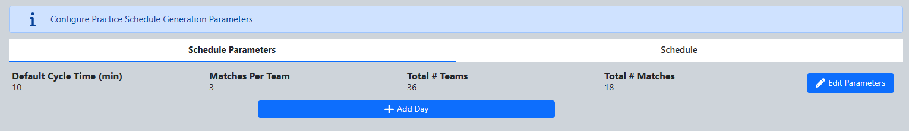
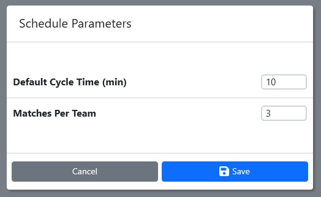
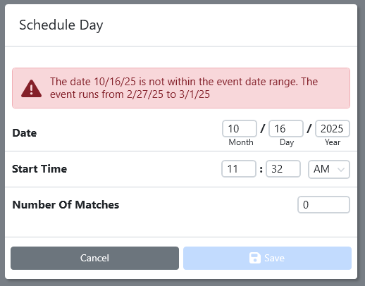
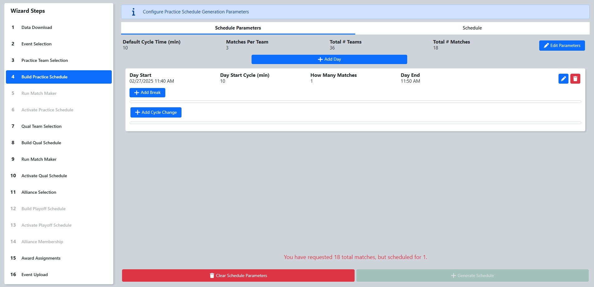
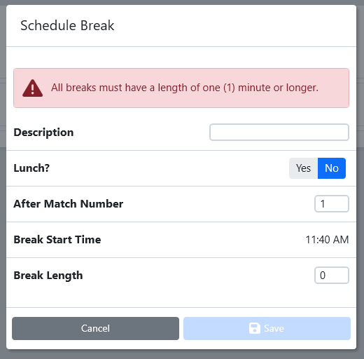
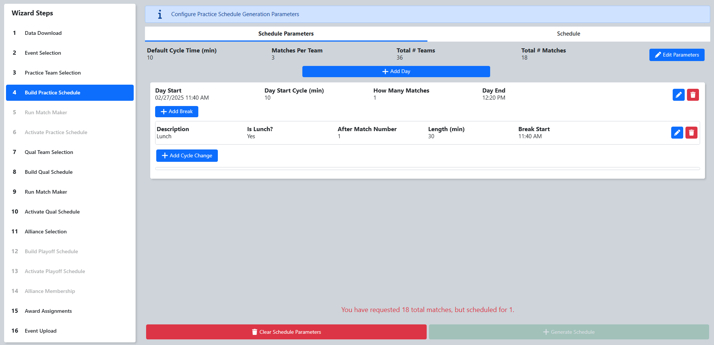
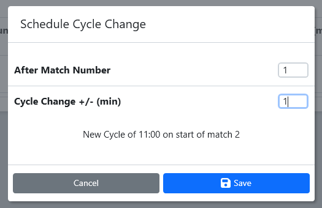
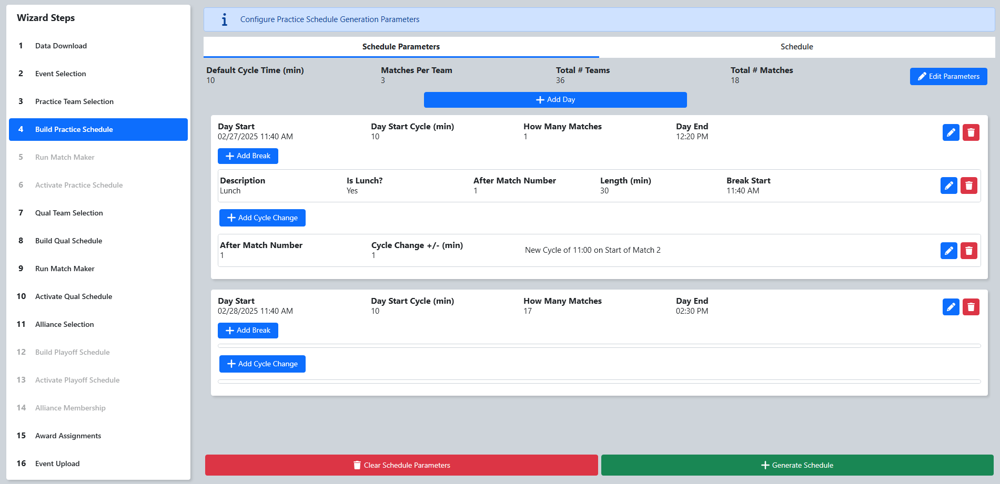
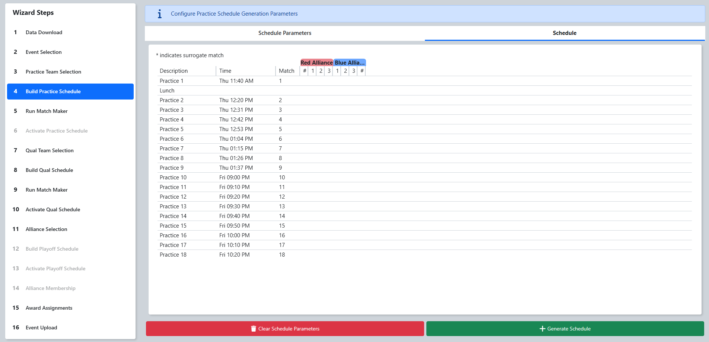

.. _event-wizard-build-schedule:

Build Schedule
======================

Define Tournament Level Parameters
##################################

Tournament levels are configured and managed in the build steps of the Event Wizard. This step is used to setup the schedule for the Day(s), the lunch period, number of matches per team,
and match duration. This documentation will build a traditional two day qualification tournament. Click the "Edit Parameters" button to edit the schedule parameters for this tournament.

* Enter the initial Cycle Time (in minutes) for matches, which should be pre-populated with the suggested value. This is the start-to-start time for matches. This time can change across the day or between days using the "Add Cycle Change" button described later.
* Enter the number of matches per team (which will usually be pre-populated with the number required by *FIRST* HQ)
* Click Save if you have made any changes.

Confirm the number of Teams matches the number expected (as defined in the Team Selection step). This is critical to team experience (not having to re-do a schedule if a 
team is added/missing). Please confirm with the event manager / appropriate party that all teams are present or accounted for before building a schedule.

The number of matches that will be needed will be displayed on the far right (Total # Matches, calculated as Matches per Team multiplied by Total # Teams)

Add Days
########

Once the level parameters have been defined, days must be added. A Day should be added for each day on which matches will be played for that tournament level
(normally one day for practice, two for qualifications and one for playoffs). Use the "Add Day" button to add the number of days necessary to the list.

* Confirm the start date and time for the day.

.. warning::
    It is critical to confirm the correct date and day of week- it cannot be changed without regenerating the schedule.

* Enter the approximate number of matches for the day (estimates are fine, this can be adjusted as breaks and cycle changes are added)
* Click Save to complete adding the day. The parameters defined in this dialog will be displayed on screen for that day.

If necessary, a Day (and any associated breaks and cycle changes) can be deleted by using the red button with the Trash Can icon. A day can also be edited to adjust the above parameters at any time by clicking the blue button with the Pencil icon.

.. note::
    The total number of matches over the course of all days in a level must be the same as the Total # Matches shown at the top of the parameters window

Add Breaks
##########

Once level days have been defined, day breaks can be added. Breaks can be added for things like lunch, speakers, sponsor presentations, etc.
Breaks are associated with a particular day, which means the matching Add Break button must be used under the matching day on which the break will occur.

Press the "Add Break" button to add the appropriate number of breaks to each day on your schedule. There is no limit to the number of breaks on a particular day.

Short description will appear on the printed schedules, website, and API

If the break is related to a lunch or meal, click the toggle which will affect the appearance on the web

The match number after which the break will happen must be unique, i.e. no cascading breaks

The Break Start Time will be displayed based on the criteria entered (i.e. if the event remains on schedule, the break will start at that time).

The Break Length (in minutes) of the break measured from the end of the proceeding match to the start of the next match.

Click the Save button and the information entered will be displayed on the day.

If any breaks must be removed, they can be deleted using the corresponding red button with the Trash Can icon on the right side of the break. A break can also be edited at any time by clicking the blue button with the Pencil icon.

.. note::
    Once the schedule has been generated (teams have been assigned to matches) breaks and cycle changes cannot be changed or removed. If a break is no longer needed, it should simply be ignored.

Add Cycle Changes
#################

Once level days and breaks have been defined, cycle changes can be added. Cycles are associated with a particular day, which means the matching "Add Cycle Change"
button must be used under the matching day on which the change will occur.

The primary intended use for Cycle Changes are to allow teams and field staff to have a slightly slower cycle time for each team's first appearance on the field that day,
then lower that cycle time for the remainder of the day.

Press the "Add Cycle Change" button to add the appropriate number of changes to each day on your schedule. There is no limit to the number of cycle changes on a particular day, though *FIRST* HQ recommends no more than one change.

The match number after which the change will happen (must be unique, i.e. no cascading changes)

The cycle change that will happen in whole minutes. Negative numbers will make the cycle "faster" while positive numbers will make the cycle "slower"

Below the cycle change details displays when the change will take place and what the new cycle will be, relative to the event schedule. Decimals (partial minutes) are allowed, but not recommended.
Reports and other areas of the software do not show partial minutes, and this may cause confusion for viewers.

Click the Save button to add the Cycle Change to the day. The information entered in this dialog will be displayed on the day.

If any changes must be removed, they can be deleted using the corresponding red button with a Trash Can icon. A Cycle Change can also be edited at any time by clicking the blue button with a Pencil icon.

.. note::
    Once the schedule has been generated (teams have been assigned to matches) breaks and cycle changes cannot be changed or removed. If a break is no longer needed, it should simply be ignored.

Confirm and Generate
####################

Before generating the schedule, confirm all data is accurate as displayed. Particularly those items indicated with red boxes as pictured as these are critical to event schedule.
If the event has a Regional Director (RD) or show manager, the schedule should be reviewed with them as well.

Click the Generate Schedule button once all the critical details are confirmed.

Review
######

After generation, select the "Schedule" tab to view the full schedule based on the parameters that were supplied.
This schedule should again be reviewed for accuracy with any appropriate parties. Breaks/changes cannot be made later without 
regenerating the full schedule and losing any played matches.

The displayed schedule times are fixed and will not update, "The Schedule is The Schedule" so to speak. Even if the event is running ahead or behind, the schedule times will remain the same.

.. note::
    As a general rule of thumb, events should not be operating more than one cycle time ahead of schedule. For example, if your cycle time is 7 minutes, then your "ahead behind" time should be "7 minutes ahead" or less.
    Getting too far ahead can be confusing to teams, parents, VIPs, sponsors, etc. who show up or tune in to see a particular team compete only to find out the match was played early. Running ahead could cause an online viewer to miss important content.

Playoff Notes
#############

In order to generate a Playoff Schedule, alliance selection must be complete. If it is not, an error message will be presented.

The software will only populate the initial round of matches in Playoffs. As alliances advance in the Playoff Tournament the software will automatically them.