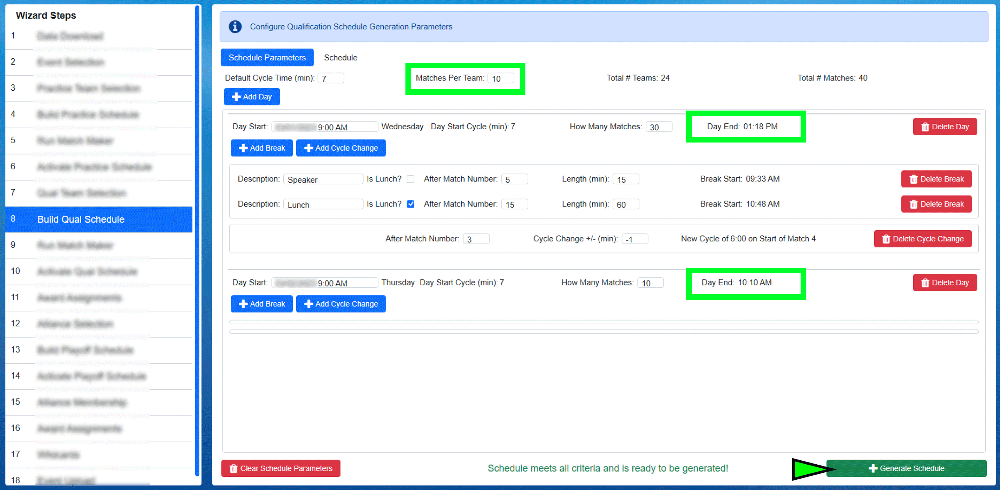

.. _event-wizard-build-schedule:

Build Schedule
======================

Define Tournament Level Parameters
##################################

.. image:: images/build-schedule-1.png

Tournament levels are configured and managed in the build steps of the Event Wizard. This step is used to setup the schedule for the Day(s), the lunch period, number of matches per team,
and match duration. This documentation will build a traditional two day qualification tournament.

[*Green Box*] Enter the initial Cycle Time (in minutes) for matches, which should be pre-populated with the suggested value. This is the start-to-start time for matches. This time can 
change across the day or between days using the "Add Cycle Change" button described later.

[*Pink Box*] Enter the number of matches per team (which will usually be pre-populated with the number required by *FIRST* HQ)

[*Gold Box*] Confirm the number of Teams matches the number expected (as defined in the Team Selection step). This is critical to team experience (not having to re-do a schedule if a 
team is added/missing). Please confirm with the event manager / appropriate party that all teams are present or accounted for before building a schedule.

The number of matches that will be needed will be displayed on the far right (Total # Matches)

Add Days
########

.. image:: images/build-schedule-2.png

Once the level parameters have been defined, days must be added. A Day should be added for each day on which matches will be played for that tournament level
(normally one day for practice, two for qualifications and one for playoffs). Use the "Add Day" button (*marked in Green*) to add the number of days necessary to the list.
If necessary, a Day (and any associated breaks and cycle changes) can be deleted by using the "Delete Day" button (*marked in Gold*).

[*Pink Box*] Confirm the start date and time for each day of the level. The day of the week is displayed next to the box, and should be used to confirm the schedule day is entered correctly.

.. warning::
    It is critical to confirm the correct date and day of week- it cannot be changed without regenerating the schedule.

[*Blue Box*] Enter the approximate number of matches for each day of the level (estimates are fine, this can be adjusted as breaks and cycle changes are added)

.. note::
    The total number of matches over the course of all days in a level must be the same as the Total # Matches shown at the top of the parameters window

Add Breaks
##########

.. image:: images/build-schedule-3.png

Once level days have been defined, day breaks can be added. Breaks can be added for things like lunch, speakers, sponsor presentations, etc.
Breaks are associated with a particular day, which means the matching Add Break button must be used under the matching day on which the break will occur.

[*Green Box*] Press the "Add Break" button to add the appropriate number of breaks to each day on your schedule. If any breaks must be removed, they can be deleted using the corresponding red Delete Break button. There is no limit to the number of breaks on a particular day.

[*Red Box*] Short description (which will appear on the printed schedules and the web)

[*Pink Box*] If the break is related to lunch/a meal, check this box (which will affect the appearance on the web)

[*Gold Box*] The match number after which the break will happen (must be unique, i.e. no cascading breaks)

[*Purple Box*] The length (in minutes) of the break measured from the end of the proceeding match to the start of the next match

To the right of the break length the start time will be displayed based on the criteria entered (i.e. if the event remains on schedule, the break will start at that time).

.. note::
    Once the schedule has been generated (teams have been assigned to matches) breaks and cycle changes cannot be changed or removed. If a break is no longer needed, it should simply be ignored.

Add Cycle Changes
#################

Once level days and breaks have been defined, cycle changes can be added. Cycles are associated with a particular day, which means the matching "Add Cycle Change"
button must be used under the matching day on which the change will occur. 

The primary intended use for Cycle Changes are to allow teams and field staff to have a slightly slower cycle time for each team's first appearance on the field that day,
then lower that cycle time for the remainder of the day.

[*Green Box*] Press the "Add Cycle Change" button to add the appropriate number of changes to each day on your schedule. If any changes must be removed, they can be deleted using the corresponding red Delete Cycle Change button.
There is no limit to the number of cycle changes on a particular day, though *FIRST* HQ recommends no more than one change.

[*Purple Box*] The match number after which the change will happen (must be unique, i.e. no cascading changes)

[*Pink Box*] The change that will happen in whole minutes. Negative numbers will make the cycle "faster" while positive numbers will make the cycle "slower"

To the right of the cycle change details will confirm when the change will take place, relative to the event schedule. Decimals (partial minutes) are allowed, but not recommended.
Reports and other areas of the software do not show partial minutes, and this may cause confusion for viewers.

.. note::
    Once the schedule has been generated (teams have been assigned to matches) breaks and cycle changes cannot be changed or removed. If a break is no longer needed, it should simply be ignored.

Confirm and Generate
####################

Before generating the schedule, confirm all data is accurate as displayed. Particularly those items indicated with red boxes as pictured as these are critical to event schedule.
If the event has a Regional Director (RD) or show manager, the schedule should be reviewed with them as well.

[*Green Indicator*] Click the Generate Schedule button once all the critical details are confirmed.

In the example below, we've accidentally attempted to create a schedule that starts at 9:00 PM instead of 9:00 AM. We could still go with 9:00 PM if we wish by selecting Yes, or selecting No to 
go back and make a correction.

.. image:: images/build-schedule-6.png

There are other messages that can appear during this process as well. It is important to read and understand them, and contact support if unsure.
For example, below, a schedule is being made in Eastern time but HQ believes the event should be in Central time. Confirmation is required before continuing.

.. image:: images/build-schedule-7.png

Review
######

After generation, select the "Schedule" tab (*green box*) to view the full schedule based on the parameters that were supplied.
This schedule should again be reviewed for accuracy with any appropriate parties. Breaks/changes cannot be made later without 
regenerating the full schedule and losing any played matches.

The displayed schedule times are fixed and will not update, "The Schedule is The Schedule" so to speak. Even if the event is running ahead or behind, the schedule times will remain the same.

.. note::
    As a general rule of thumb, events should not be operating more than one cycle time ahead of schedule. For example, if your cycle time is 7 minutes, then your "ahead behind" time should be "7 minutes ahead" or less.
    Getting too far ahead can be confusing to teams, parents, VIPs, sponsors, etc. who show up or tune in to see a particular team compete only to find out the match was played early. Running ahead could cause an online viewer to miss important content.

Playoff Notes
#############

In order to generate a Playoff Schedule, alliance selection must be complete. If it is not, an error message will be presented.

The software will only populate the initial round of matches in Playoffs. As alliances advance in the Playoff Tournament the software will automatically them.