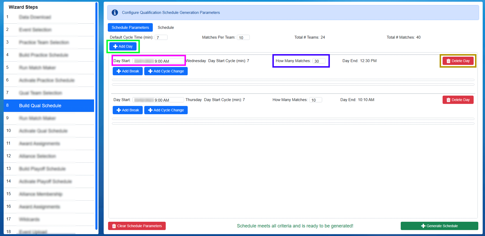

Build Schedule
==============

Though only displayed here once, this step is the same for both the Practice and Qualification portions of the event.

Define Tournament Level Parameters
----------------------------------

Tournament Levels are configured and managed in the build steps of the Event Wizard. This step is used to setup the start and stop times for the Day(s), the lunch period, number of matches per team, and match duration. In our example steps, we'll be building a two day qualification tournament.

(1) Confirm the number of Teams matches the number expected (as defined in the `Team Selection <../../eventmanager/l/607972-team-selection>`_ step). This is critical to team experience (not having to re-do a schedule if a team is added/missing). Please confirm with the event manager / appropriate party that all teams are present or accounted for before building a schedule.

(2) Enter the Cycle Time (in minutes) for matches. This is the start-to-start time for matches

(3) Enter the number of matches per team (which will usually be pre-populated with the number required by *FIRST* HQ)

The number of matches that will be needed will be displayed on the far right (Total # Matches)

Add Days
--------

Once the level parameters have been defined, days must be added. A Day should be added for each day on which matches will be played for that tournament level (normally one day for practice, two for qualifications and one for playoffs). Use the button marked in Green to add the number of days necessary to the list. If necessary, a Day (and any associated breaks) can be deleted by using the Orange marked button.

[Red] Confirm the start date and time for each day of the level. The day of the week is displayed in red next to the box, and is used to confirm the schedule day is entered correctly.

[Blue] Enter the approximate number of matches for each day of the level (estimates are fine, this may need adjustment as breaks are added)

NOTE: the total number of matches over the course of all days in a level must be the same as the *Total # Matches* shown at the top of the parameters window

Add Breaks
----------

.. image:: images/build-schedule-4.png

.. image:: images/build-schedule-5.png

Once level days have been defined, day breaks can be added. Breaks can be added for things like lunch, speakers, sponsor presentations, etc. Breaks are associated with a particular day, which means the matching *Add Break* button must be used under the matching day on which the break will occur. Press the Add Break (marked in Green) button to add the appropriate number of breaks to each day on your schedule. If any breaks must be removed, they can be deleted using the *Delete Break* button shown in Orange. There is no limit to the number of breaks on a particular day. For each break, parameters must be defined:

[Red] Short description (which will appear on the printed schedules and the web)

[Purple] If the break is related to lunch/a meal, check this box (which will affect the appearance on the web)

[Blue] The match number after which the break will happen (must be unique, i.e. no cascading breaks)

[Pink] The length (in minutes) of the break before the next match should start

To the right of the break length the start time will be displayed based on the data entered (i.e. if the event remains on schedule, the break will start at that time).

Add Cycle Changes
-----------------

Once level days and breaks have been defined, cycle changes can be added. Cycles are associated with a particular day, which means the matching *Add Cycle Change* button must be used under the matching day on which the change will occur. Press the Add Cycle Change (marked in Green) button to add the appropriate number of changes to each day on your schedule. If any changes must be removed, they can be deleted using the *Delete Cycle Change* button shown in Orange. There is no limit to the number of cycle changes on a particular day, though *FIRST* HQ recommends no more than one change. For each change, parameters must be defined:

[Red] The match number after which the change will happen (must be unique, i.e. no cascading changes)

[Blue] The change that will happen. Negative numbers will make the cycle "faster" while positive numbers will make the cycle "slower"

To the right of the cycle change details will confirm when the change will take place, relative to the event schedule. While decimals (partial minutes) are allowed, it is not recommended. Reports and other areas of the software do not show partial minutes, and this may cause confusion for viewers.

Validation Messages
-------------------

.. image:: images/build-schedule-8.png

If any data entered is not valid, a message will appear on the bottom left and the *Generate Schedule* button will become disabled. The validation message will contain the date (when applicable) followed by the message text. All validation errors must be corrected before a schedule can be generated.

Confirm and Generate
--------------------

.. image:: images/build-schedule-11.png

Before generating the schedule, confirm all data is accurate as displayed. Particularly those items indicated with red arrows, which are most critical to event schedule. If the event has a Regional Director (RD) or show manager, the schedule should be reviewed with them as well.

If all information is accurate, click the *Generate Schedule* button marked with the Green arrow. While generating, the screen will turn gray and the "busy" indicator will show on the bottom right. A confirmation dialog will appear when the process completes. Messages may appear to provide warning about elements of the schedule, and off Yes/No selections before continuing to generate the schedule.

In the example below, we've accidentally attempted to create a schedule that starts at 9:00 PM instead of 9:00 AM. We could still go with 9:00 PM if we wish by selecting Yes, or selecting No to go back and make a correction.

.. image:: images/build-schedule-13.png

There are other messages that can appear during this process as well. It is important to read and understand them, and contact support if unsure. For example, below, we're attempting to make a schedule in Eastern time, but *FIRST* believes the event should be in Pacific time. Confirmation is required before continuing.

.. image:: images/build-schedule-15.png

Review
------

.. image:: images/build-schedule-17.png

After generation, clicking the "Schedule" tab (marked with a red box) will present the full schedule based on the parameters that were supplied. This schedule should again be reviewed for accuracy with any appropriate parties. Breaks/changes cannot be made later without redoing other steps (such as Match Maker) or losing match progress (if matches have been played) so it is important to have the schedule be accurate from the start.

Notes:

Note that these times are fixed and will not update, “ *The Schedule is The Schedule* ” so to speak.

The goal should be to play as close to the original published schedule as possible, without getting more than 4-5 minutes ahead. The timer on the bottom bar ( `see here <../../eventmanager/l/560426-indicators>`_ ) will display ahead/behind information.

It is recommended to not get too far ahead regardless of how well things are going as this can be confusing to teams, as well as parents, VIPs, sponsors, etc. who show up to see a particular team compete only to find out the match was played early. Much of the audience is also online for FRC events, and may be tuning into the event broadcast based on the published schedule and matches. Running ahead could cause a viewer to miss important content.

Playoff Notes
-------------

Once the Alliance Selection has been completed, the next step in the Event Wizard is to configure the Playoff Tournament. In order to generate a Playoff Schedule, alliance selection must be complete. If it is not,an error message will be presented saying to complete the alliance selection process.

The FMS software will only populate the quarterfinal matches (or octofinals/semifinals for other size tournaments) initially in Playoffs. As alliances advance in the Playoff Tournament the software will automatically populate the next round as teams advance from the prior rounds.

