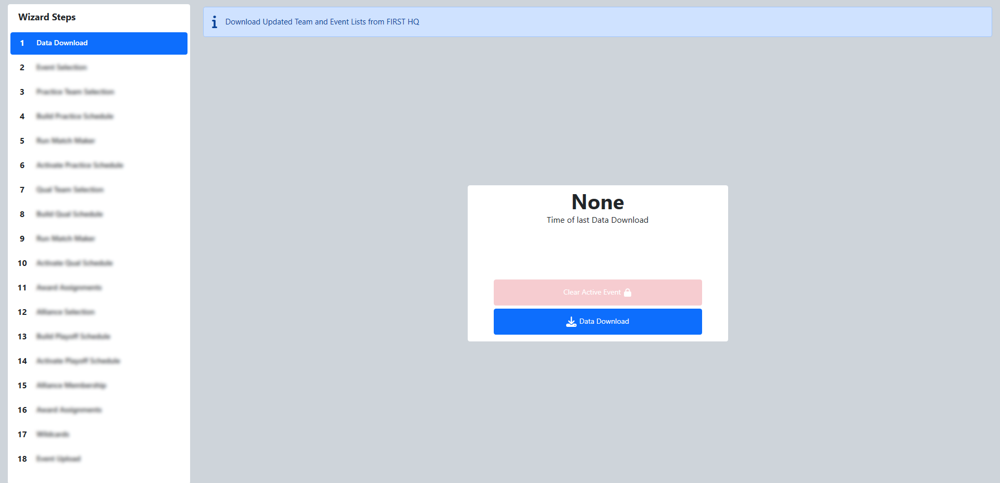

.. _event-wizard-data-download:

Data Download
======================

The Data Download step of the Event Wizard is used to download the complete event list of all official FIRST Robotics Competition Events and Teams.
It will also ensure that the data is up-to-date with any changes the teams may have made to their Team Registration profile. Data download should be
done at the start of each competition and can optionally be done again at a later time to query for any changes that may continue to be made.
For example, if a team changes their name in the dashboard, it would need to be retrieved using Data Download (after being processed by FIRST HQ)
before it would be reflected in reports or across other portions of the software.

For more information on how FMS collects and uses data, please see the data services page on http://frc.events

This step also downloads all approved Team Avatars.

This step does not apply to FMS Off-Season as the software installation includes the complete registered team list from the current season.
