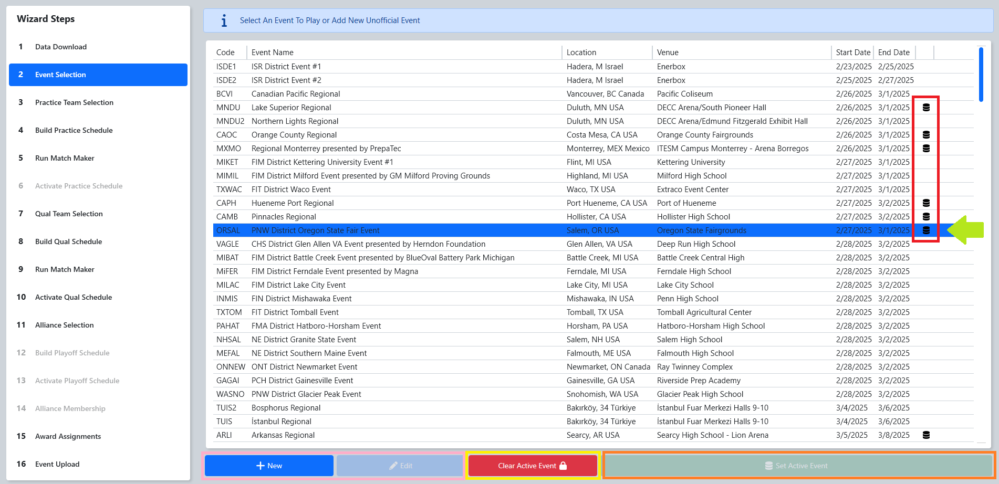
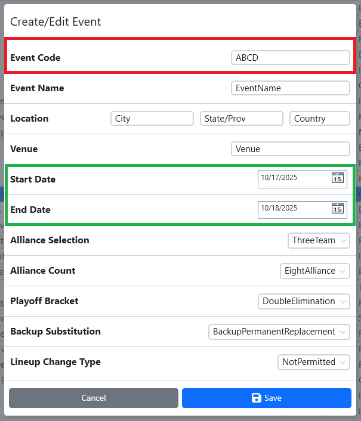
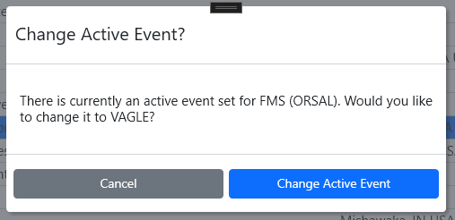
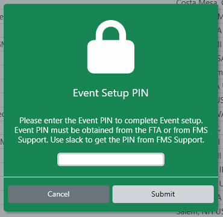
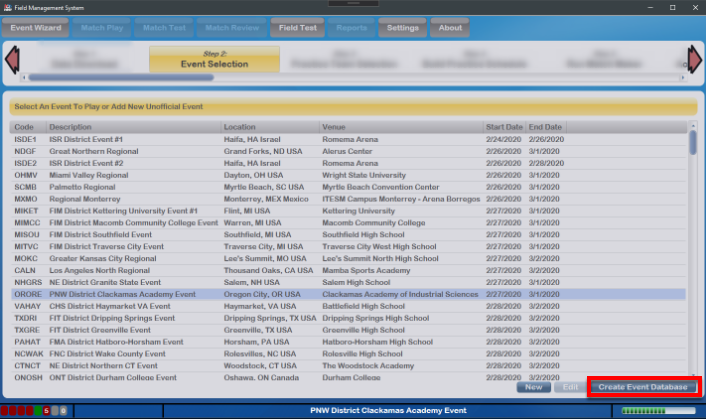
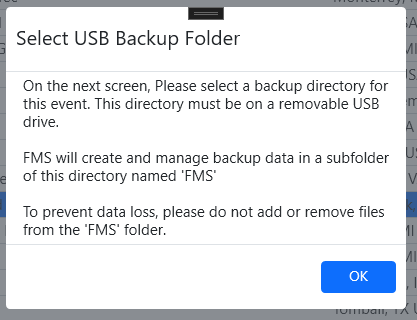
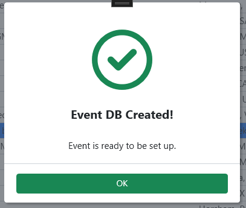

.. _event-wizard-event-selection:

Event Selection
======================

Selecting a traditional event
#############################

|
| The Event Selection step of the Event Wizard displays the complete list of events from Data Download.
	Select the event to be played by clicking on it. In this example, the selected event is shown with a green marker and highlighted blue background on the row.

[**Green Marker**] The currently selected event, if there is one, will be shown with a highlighted row background

[**Pink Box**] The "new" and "edit" buttons can be used to manipulate Off-Season events

[**Yellow Box**] Clear the currently active event in FMS and have no active event. This will disable all event wizard steps after event selection.

[**Orange Box**] Set selected event as active and create the event database if one has not been created yet (see below)

[**Red Box**] Database icon to identify events that have a database on this computer

Creating an Off-Season Event
##############################

|
| For FMS Off-Season, clicking "New" will allow the addition of an unofficial (Off-Season) event. Only events added with the "New" button can be edited,
	those downloaded from *FIRST* are protected from edits (including off-season events that come from *FIRST* HQ). If you've requested to sync results with *FIRST* HQ, do not manually add your event.
	Instead, use data download to receive it and use the downloaded event.

The Event Code (**red box**) must be unique from any other events on the machine (official events or Off-Season events).

.. note::
	Make sure the inclusive start and end dates (**green box**) are marked properly, as they are used to validate schedules.

The alliance count and playoff style can also be edited on this screen, but only before the playoff tournament process has begun (i.e. until Alliance Selection). It cannot be changed in a downloaded event (Official or Off-Season)

Changing Active Event
#######################

Once the target event has either been selected or created, it must be set as the active event and a database must be created (if necessary) to store the event results.
Click the "Set Active Event" button (the **orange box** in the first screenshot on this page). 

|
| If there is currently an active event in FMS, there will be a dialog to confirm the action of changing the active event. Confirm the event to be activated is correct and click the "Change Active Event" button. 

For official events, an Event PIN prompt will be presented before a database can be created.

Event PINs
##########

|
| For traditional events, and Off-Season events that are Syncing data with *FIRST*, clicking "Create Event Database" will prompt for an Event PIN to be entered.
	The FTA will need to enter the PIN number they were provided by *FIRST* HQ. Upon pressing Submit, the creation process proceed as described below.

Event Database Creation in Progress
###################################

|
| The system will create a new database to store the event results and data. This will temporarily disable the screen until the process is complete. 
	This process also populates registration information, team award history and more from the cloud.

Event Backup Directory
######################

|
| Once the event database has been created, a new dialog will appear to prompt for a event backup directory. The event backup directory cannot be on the OS drive and must be on a removable USB drive. Click OK and a folder selector dialog will appear. Select the desired directory for event backups and click Select Folder.

.. note::
	If you click Cancel on the folder select dialog, you can still go to Settings page -> Backup tab.

|
| Once the process completes, and each time this step is re-opened thereafter, the button will be disabled as the database has already been created.