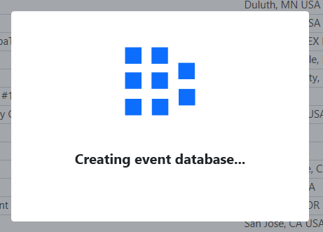

Event Selection
===============

Get your event started...

Selecting a Traditional Event
-----------------------------

.. image:: images/event-selection-1.png

The Event Selection step of the Event Wizard displays the complete list of downloaded events from Data Download. On this step, select the event to be played. In this case, the selected event is shown with a green arrow and highlighted blue background on the row.

[ *Green Arrow* ] The currently selected event, if there is one, will be shown with a highlighted row background

[ *Red* ] The "new" and "edit" buttons can be used to manipulate Off-Season events

[ *Black* ] Create a database for a selected event (see below)

Creating an Off-Season Event (Optional)
---------------------------------------

.. image:: images/event-selection-2.png

.. image:: images/event-selection-3.png

For FMS Off-Season, clicking “New” (in the red box above) will allow the addition of an unofficial (Off-Season) event. Only events added manually can be edited, those downloaded from *FIRST* are protected from edits (including off-season events that come from *FIRST* ). If you've requested to sync results with *FIRST* HQ, do not manually add your event. Instead, use data download to receive it and use the downloaded event.

The Event Code (red arrow) must be unique from any other events on the machine- regardless of whether they are official or not. Additionally, it's important to make sure the inclusive start and end dates (blue arrow) are marked properly, as they're used to validate schedules and could create problems in later steps if marked inaccurately.

The alliance count and playoff style can also be edited on this screen, but only before the playoff tournament process has begun (i.e. until Alliance Selection). It cannot be changed in a downloaded, off-season event.

Creating Event Database
-----------------------

.. image:: images/event-selection-5.png

Once the target event has either been selected (traditional event) or created (off-season event) it will need a database to store its results. To initiate this process, click the "Create Event Database" button (shown here in the red box). For an Off-Season event, the Database is automatically created. For a tradition event, an additional window(s) are displayed, as described in the next step.

Event PINs
----------

.. image:: images/event-selection-6.png

For traditional events and Off-Season events that are Syncing data with FIRST, clicking "Create Event Database" will trigger the window shown above. On this screen, the FTA will need to enter the PIN number they were provided by *FIRST* . Upon doing so and pressing Submit, the creation process proceeds as described below.

Event Database Creation in Progress
-----------------------------------

.. image:: images/event-selection-9.png

Once the target event has had the correct PIN entered, the system will create a location to store the event's results and data. This will temporarily disable the screen (as indicated by the working bar on the lower right) as the event database is created. This will populate registration information, team award history and more.

Once the process completes, and each time this step is re-opened thereafter, the button will be disabled as the database has already been created.

