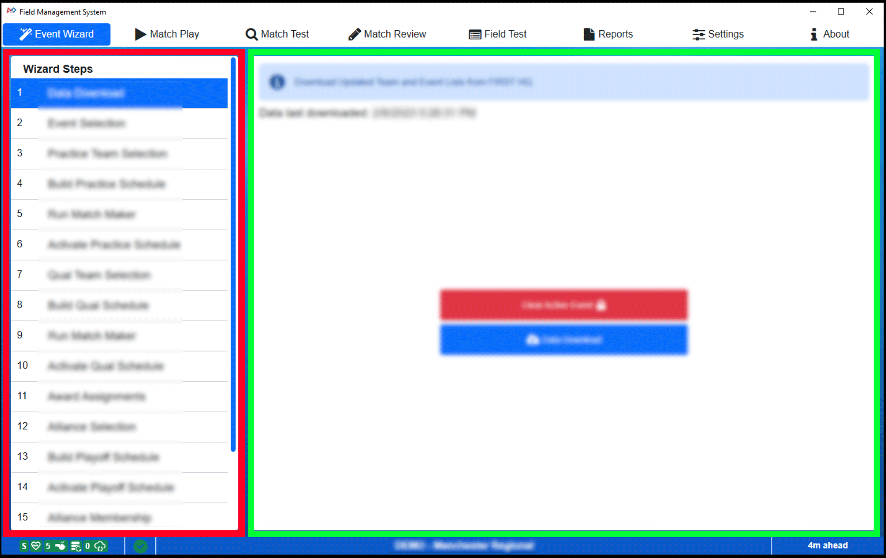

.. _event-wizard-nav:

Event Wizard Navigation
=================================

|
| The Event Wizard is used to guide the Scorekeeper through the entire multi-day tournament. It is organized such that the user can configure a portion of the tournament,
	the Practice schedule for example, then go to Match Play and play through all those matches. Once finished, the user returns to the Event Wizard to configure the next part of the tournament.
	This process continues until the entire wizard is complete.

Each step of the Event Wizard is shown in this chapter along with a detailed description of the functionality found on each page. For some elements, like activating a schedule,
the process is the same for all phases of the tournament. In those cases, the steps are not shown multiple times, but rather noted that it applies multiple times and only listed once.

Steps that are not available or not applicable will be disabled. Steps will enable/disable as prerequisites are completed and the event progresses.

[*Red Box*] The left side of the screen is used to navigate between available wizard steps.

[*Green Box*] The right side displays the content for the selected wizard step.