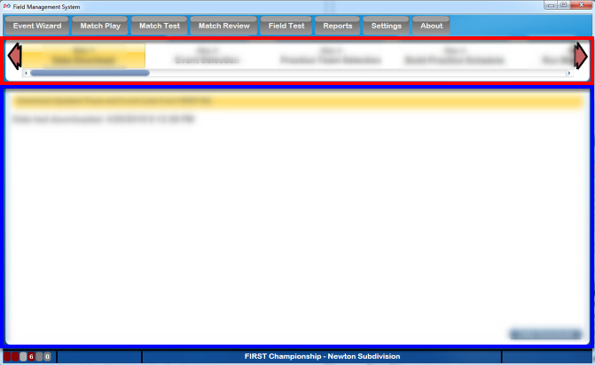

.. _event-wizard-nav:

Event Wizard Navigation
=================================

The Event Wizard is a tool to guide the Scorekeeper through the entire multi-day tournament. It is organized such that the user can configure a portion of the tournament, the Practice schedule for example, then go to Match Play and play through all those matches. Once finished, the user returns to the Event Wizard to configure the next part of the tournament. This process continues until the entire wizard is complete.

Each step of the Event Wizard is shown in this chapter along with a detailed description of the functionality found on each page. For some elements, like activating a schedule, the process is the same for all phases of the tournament. In those cases, the steps are not shown multiple times, but rather noted that it applies multiple times and only listed once.

[Red - Navigation] Using the top portion of the screen, navigate between steps of the wizard by clicking the arrows on either side or directly on the step itself. Use the scroll bar to quickly zoom the view of the steps from one side to the other.

[Blue - Content] The lower portion of the screen will change to display the content based on the selection from the navigation portion of the display.