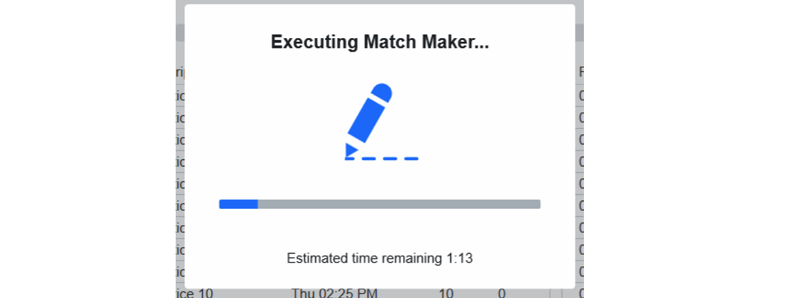
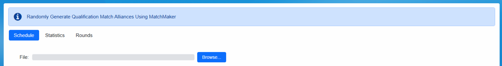

.. _event-wizard-match-maker:

Run Match Maker
======================

Execute Match Maker
###################

Once the match schedule has been generated it’s necessary to generate the alliances. The MatchMaker algorithm is used for this purpose.  It creates over 5 million possible schedules and selects the best one that meets the criteria outlined in the FRC Manual. Match Maker should only be run one time for the Practice schedule, and one time for the Qualification schedule. If for some reason it is believed that the schedule is not optimum, consult FRC Engineering for additional review. This process should be done with the FTA present.

The schedule generated in the previous step will be present on the Match Maker step. To begin the pairing process, click the Execute Match Maker button (marked with the Red arrow). Confirmation will be required that new execution is requested, as any previous executions will be removed.

Match Maker In Progress
#######################

Upon execution, Match Maker will begin formulating the alliances. On the lower left, a progress message will indicate how much time (approximately) is remaining in the process. This process takes more time when more teams are involved- occasionally upwards of four minutes. The process should not be interrupted. Upon completion, a success (or failure) message will be presented. Match Maker can only run if the user has Administrator permissions on the server (and has FMS running as an admin).

Review Schedule
###############

.. image:: images/run-match-maker-3.png

When the process in complete, the team numbers will be shown in place on the schedule. If any teams are playing as a Surrogate, the box to the right of the team number will be checked (shown with the Green arrow). The schedule (now showing the alliances) should match what was entered on the previous step.

Review Statistics
#################

Definitions of the content in each column on the statistics tab is as follows:

Team = Team Number
Matches = number of matches played which are used to calculate rankings. This number should match the number in "Matches Per Team” at the top of the build screen.
Surrogates = number of matches played in which this team is a surrogate. Teams should only play 1 surrogate match maximum. If for some reason you see a number greater than 1 in this column, click the Generate Schedule button again to regenerate the alliance pairings.
# Partners = total number of different alliance partners. The total possible number of different alliance partners is the number of matches played * 2
# Opponents - total number of different opponents. The total possible number of different opponents is the number of matches played * 3.
Alliance Partners = a complete list of all the teams which will be on an alliance with the team in the Team column. Notation is given as Team Number (number of times this team will be on your alliance). For example: 812(2) means the team in question will be on an alliance with team 812 twice over the course of all Qualification matches.
Opponents = A complete list of all teams which will be an opponent of the team in the Team column. Notation is the same as Alliance column.
If a team is playing with (or against) the same team multiple times, it will be shown in parentheses next to the other team's number, as shown in the orange box above.

If the statistics seem unsatisfactory, contact FRC Engineering before re-running the Match Maker process in order for additional steps to be taken.

Rounds
######

The "Rounds" tab displays information about the number of matches that must be played for a "round" to be completed (i.e. each team has played one additional match). This tab is primarily for use by event support. For off-season events, it could be used to understand where to end matches if Qualification matches must be skipped due to time. Rounds data is not displayed for the Practice Schedule.

Alternate Alliance Pairing Method (Optional)
############################################

If an alternative Alliance Pairing Algorithm is desired for the Practice or Qualification Tournament, in can be imported into the FMS software. This is done on either "Run Match Maker" step in the Wizard. This is not supported for official FIRST Events.

Before adding pairings, the schedule itself must be generated on the previous step. Schedules (time/date portion) cannot be imported, only the pairings.

Select the file using the Browse... button, and click Load Matches from File on the bottom of the display (not pictured). The imported alliance pairings overwrite the alliances generated by the FMS software, but retain the scheduled match times. Do not use the Execute Match Maker button if a custom pairing is being loaded.

The fields in the import file must be (Each match is one line, for a total of 13 fields per line, tab delimited):

Field1 = Match Number - A number that represents the match number

Field2 = Red Team 1 Number - A number that represents a team number

Field3 = Red Team 1 Is Surrogate - true or false indicating that the team is a surrogate

Field4 = Red Team2 Number - A number that represents a team number

Field5 = Red Team2 Is Surrogate - true or false indicating that the team is a surrogate

Field6 = Red Team3 Number - A number that represents a team number

Field7 = Red Team3 Is Surrogate - true or false indicating that the team is a surrogate

Field8 = Blue Team 1 Number - A number that represents a team number

Field9 = BlueTeam1 Is Surrogate - true or false indicating that the team is a surrogate

Field10 = BlueTeam2 Number - A number that represents a team number

Field11 = BlueTeam2 Is Surrogate - true or false indicating that the team is a surrogate

Field12 = BlueTeam3 Number - A number that represents a team number

Field13 = BlueTeam3 Is Surrogate - true or false indicating that the team is a surrogate

An example of this file can be found in the Appendix. (LINKHERE)