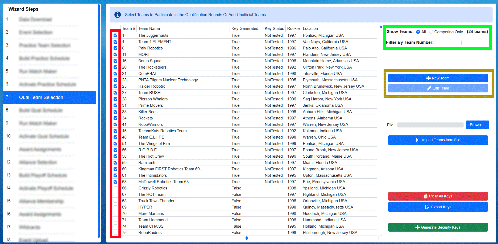

.. _event-wizard-team-selection:

Team Selection
======================

.. _wpa_kiosk:

View and Add Registrations
##########################

Team Selection displays the downloaded list of registered FRC teams, with those registered for the event pre-checked. This list should be used to verify all the teams registered are actually present at the venue.

.. note::
  The Qualification schedule should not be generated until all teams have arrived at the venue, or otherwise instructed by HQ and/or the local event manager. Otherwise, a schedule may need to be re-generated if a team ends up not attending and there may be confusion if multiple versions of the schedule have been created. 

[*Red Box*] Checkboxes indicate the registration status of a particular team at the event. If the box is checked, the team on that row is set as "competing" for the event. Unchecked teams are not competiting.

[*Green Box*] The count of competing (checked) teams along with the ability to filter the team list. Radio buttons can also be used to switch the view list from all FRC Teams (All) to just those that are checked (Competing Only)

[*Blue Box*] The "new" and "edit" buttons can be used to add unofficial teams for Off-Season use. These are disabled at official events.

.. note::
  Having any teams that were manually added (using "New") checked as competing teams (red column) will prevent data from being sent to FIRST (scores, results, etc) and therefore is not available in-season.

Adding Off-Season Teams (Optional)
##################################

.. image:: images/team-selection-2.png

If additional teams are needed at an Off-Season event, the "new" button (*blue box in the top photo on this page*) can be used to create a custom team. The team number (*red marker*) must be unique.
Make sure the team is checked as competing once created. Only teams added manually can be edited, those downloaded from FIRST are protected from edits.

Events with custom teams cannot sync with FIRST servers.

.. note::
  FIRST HQ has designed and "pre-loaded" a set of Teams that, while not "official teams" in FRC, can be used during the Off-Season at an event without disabling the ability to Sync with FIRST servers. These teams contain "Demo" in their name and appear at the end of the team list.

Generate Security Keys
######################

.. image:: images/team-selection-3.png

Once the teams competing at the event have all been checked off and the proper number is displayed under "Total Competing Teams", security ("WPA") keys should be generated.
This is done using the "Generate Security Keys" button (*green button inside the pink box*). Once keys are generated the "Key Generated" column will display the new status of "True".

.. note::
  If additional teams are added later, the same process can be used to generate keys for those new teams- teams with existing keys will remain untouched.

Once the keys are generated, the FTA should use the WPA Kiosk program on the WPA Laptop to download keys from FMS to the kiosk program. This download process will require FTA authentication and is outlined in more detail :ref:`wpa-kiosk-setup`.

As a backup to the traditional WPA Kiosk setup process, the Export Keys button (*blue button inside the pink box*) can be used to save the key file needed to run the Radio Kiosk.
This should only be used by the FTA, as it requires their password to complete, and is only used as a backup solution.

The schedule generation steps assume that all teams will use the same security keys throughout the event; as a result, performing Keys steps is not necessary to repeat on each Team Selection step of the Wizard (even though there are multiple).	

The Clear All Keys button (*red button in the pink box*) returns all teams to their default, keyless, state. This should only be used at the direction of FIRST HQ and requires the FTA password.

WPA Kiosk Key Download
######################

Once security keys have been generated they can be downloaded to the WPA Kiosk for team radio programming. For more information, see :ref:`wpa-kiosk-setup`.

.. note::
  Downloading keys will require FTA Authentication. At an off-season event, use the code "0000" to bypass the FTA Authentication.
