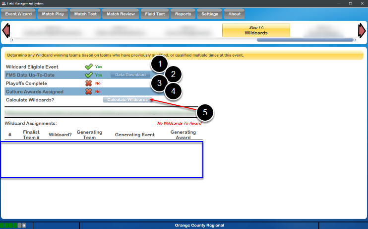

Wildcards
=========

Per the rules outlined in the FRC Manual, under specific event conditions, Wildcards may be generated at Regional events, awarding the opportunity to attend the FIRST Championship to additional teams beyond the standard number. This step of the Wizard assists the user in determining if the event generated a Wildcard, and to which team the award should be given.

Four prerequisites are required in order for the Calculate Wildcards button to become active:

Wildcard Eligible Event: Yes will be displayed if the current event is a Regional event. Wildcards are not generated at other events.
FMS Data up-to-date: The current FMS team list must have been downloaded within the last few days. If the data is old Stale will appear. Click Data Download to update the data if needed.
Playoffs Complete: All required Playoff matches have been played, i.e. there is a declared winner of the Playoff Tournament.
Culture Awards Assigned: All the FIRST Championship qualifying awards must have been assigned and awarded.
Once all prerequisites are complete, the Calculate Wildcards button (5) can be pressed. If any Wildcards are generated at the event, the recipients will be listed in the area represented by the blue box. The accompanying script for the MC to read at the conclusion of the Awards Ceremony is available via Reports (Wildcard Script).

If any validation errors occur, or any status messages, they will appear in the spot shown by the red arrow. If no Wildcards are generated, the words No Wildcards To Award will appear under the status message area, to the right.