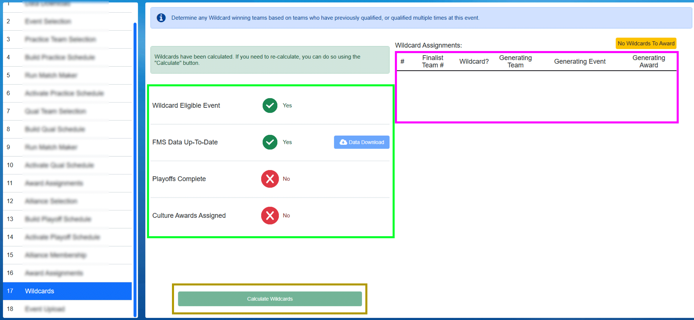

.. _event-wizard-wildcards:

Wildcards
===========

Per the FRC Manual, Wildcards are sometimes generated at Regional events and afford the opportunity for additional teams to attend
the FIRST Championship. This step of the Wizard assists the Scorekeeper in determining if the event has any Wildcards, and to which team the award should be given.

Four prerequisites (*the green box*) are required in order for the "Calculate Wildcards" button to become active:

* *Wildcard Eligible Event* - the current event must be a Regional event, Wildcards are not generated at other event types
* *FMS Data up-to-date* - The current FMS team list must have been downloaded recently. If the data is old "Stale" will appear. Click Data Download to update the data as needed.
* *Playoffs Complete* - All required Playoff matches have been played (aka there is a declared winning alliance of the Playoff Tournament)
* *Culture Awards Assigned* - All the FIRST Championship qualifying awards must have been assigned and awarded (they need not have been presented to the audience)

Once all prerequisites are complete, the "Calculate Wildcards" (*gold box*) button becomes active. If any Wildcards are generated at the event the recipients will be listed in the area
represented by the *pink box*. The accompanying script for the Emcee/Announcer to read at the conclusion of the Awards Ceremony is available via Reports (Wildcard Script).

If any validation errors occur, or any status messages, they will appear in the spot shown by the red arrow. If no Wildcards are generated, the words No Wildcards
To Award will appear under the status message area, to the right.
