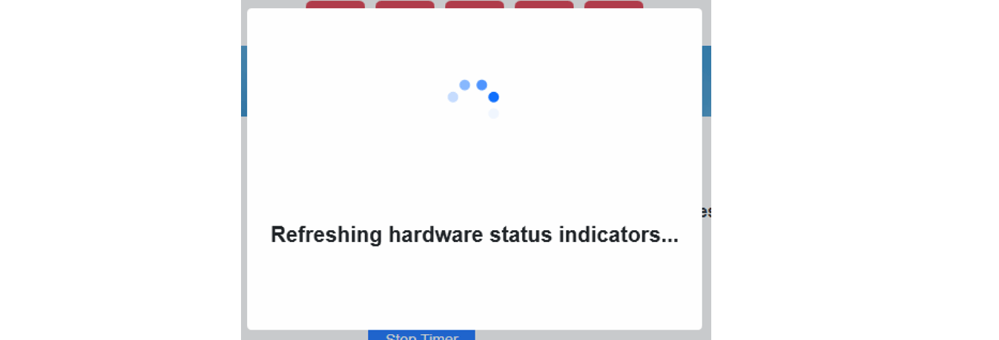

.. _field-test-field-test:

Field Test
===========

Field Test is used to confirm basic operation of all the LED Displays, Team Lights and scoring hardware.
Field Test is also used to confirm the network connections to the Audience Screen and the Internet.
After Field Test a full Match Test should be used to confirm all hardware is performing as expected in-match.
In FMS Off-Season, the Field Test screen is not accessible.

On initial load, the screen will be temporarily blocked while the status of all hardware is updated.

Interface
#############################

.. image:: images/field-test-1.png

[*Green Box*] Shows the connection status of the hardware at the corresponding areas of the playing field; Blue Alliance end, Scoring Table, and Red Alliance end. Green indicates
a successful connection. Use "Refresh Indicators" to re-check the status.

[*Red Box*] Warnings about system configuration, as detailed below.

[*Pink Box*] Communication status between FMS and each referee panel. A successful connection is shown in green.

[*Yellow Box*] Shared hardware status area, detailed below

Lights and Signs
#############################

.. image:: images/field-test-2.png

This panel is used to test the Stack Lights and team signs.

* Arena Stack Test - tests each light in the stack at the Scoring Table
* Team Light Test - tests each light in the player station (the stack lights by the team signs, not any light strings in the station)
* Timer Test - enter a time (in seconds) to manually run the timers on either end of the field
* Team Sign Test - tests the seven segment displays around the field 

  * Awards displays the season
  * Test alternates between the station number and "8888"
  * Match displays the team numbers specied to the right of the dropdown ("Team Numbers Test")

* Team Numbers Test - explicitly specify a team number to display on each team sign

.. note::
    The Team Stack Light test this will not illuminate the amber lights (E-stop indictor). E-stop lights only turn on when the E-stop in the corresponding Player Station is pushed, or the Arena E-stop is pressed

Game Specific Field Test
#############################

Please see the next page for additional information.

Network Communication
##################################

.. image:: images/field-test-3.png

* Internet - confirm an active connection to the Internet (specific ports and procedures)
* Audience Connectivity - test connection between FMS and the Audience Display program

  * The indicator turns green if **any** Audience Display is found on the network
  * Optionally, if the "play sound" box is checked, a sound is played on the located Audience Display(s)

* For each Audience Display located, a row is added to the "Displays Found" box on the right side. This display includes the name of PC running the program, the current version number and volume of the machine. Re-running the screen connectivity test will refresh the results in the box.

.. note::
  At least one instance of the Audience Display program must be running for this to be successful. A connection made to **ANY** audience screen will provide a "success." This *should not* be used as a sound test- use the audio test buttons within the Audience Display for sound tests.

Hardware Warnings
##############################

Any warnings detected during the hardware check will appear within the Field Test screen. Possible warnings include:

* Machine Firewall Enabled (pictured) - Having the firewall enabled can cause problems when FMS attempts to communicate status data to the Driver Stations. At an official event, contact support if this message is displayed.
* Spare Infrastructure Hardware on Network (not pictured) - The system has noticed spare hardware (e.g. SCC) on the network. No action needed.
* Spare Game-Specific Hardware on Network (not pictured) - The system has noticed spare game specific hardware (e.g. auxiliary control cabinet) on the network. No action needed.
* Spare Server on Network (not pictured) - It is believed that the backup (secondary) server may be on the network. Check if it is powered off, or contact support for assistance. Matches will not operate correctly with the secondary machine powered on.
* Access Point wrong Port (not pictured) - It is believed that the access point is in the wrong physical port on the scoring table
