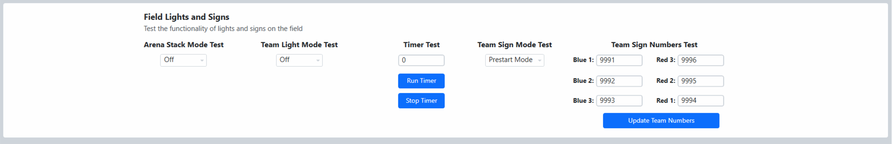
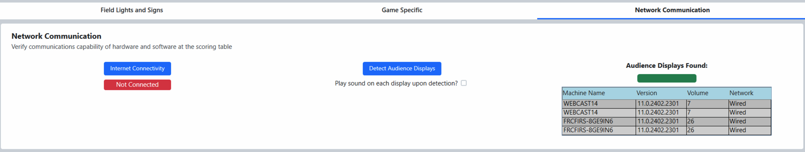

.. _field-test-field-test:

Field Test
===========

Field Test is used as an initial basic test of the field electronics. Use this interface to verify that all the LED Displays, Team Lights, and scoring hardware are connected. Field Test is also used to confirm the network connection to the Audience Screen and to the Internet. After Field Test, a full Match Test should be used to confirm all elements are behaving as expected in-match. In FMS Off-Season, the Field Test screen is not accessible.

[Red - Field Hardware]

This panel shows the connection status of the hardware at the corresponding areas of the playing field; Blue Alliance end, Scoring Table, and Red Alliance end. Green indicates a successful connection. Use “Refresh Indicators” to update these indicators.

[Ping - Warnings]

Warnings about system configuration, as detailed below.

[Blue - Referee Panels]

This panel show the connection to each of the Referee touchscreens. A successful connection is shown via a green indicator.

[Green - Individual Hardware]

See Below

Field Test - Lights and Signs
#############################

This panel is used to test the LED panels, the Stack Lights, and the LED light strings.

- Arena Stack Light tests each light in the stack at the Scoring Table
- Team Signs has two modes to test the connection to the LED displays in the Player Stations
- Test Pattern  alternates between the test values for Alliance Station number (Blue 1 = 1, Blue 2 =2, Blue 3 = 3, Red 1 = 4, Red 2 = 5, Red 3 = 6) and Timer (9) and all “8888”.
- Awards Mode  all displays show current year
- Team Stack Lights  turns on each Stack Light in the corresponding Player Station
- NOTE: this will not turn on the amber lights which indicate E-stop. E-stop lights only turn on when the E-stop in the corresponding Player Station is pushed, or the Arena E-stop is pressed
- Player Station Strings will, if in use, cycle the possible lighting options of the strings as they appear in the game.

Field Test - Network Communication
##################################

- Internet - confirm an active connection to the Internet (specific ports and procedures)
- Audience Connectivity - test connection between FMS and Audience Screen program. The indicator turns green if any Audience Display is found, in cases where there may be multiple on the field network. Optionally, if the play sound box is checked, a sound is played upon successful location of the audience display. At least one instance of the Audience Display program must be running for this to be successful. A connection made to ANY audience screen will provide a “success” (such as if multiple are running on the network) and it is not guaranteed that all audience screen instances would play the sound. This SHOULD NOT be used as a sound test, use the audio test buttons within the Audience Screen for sound tests.
- For each Audience Display located, a row is added to the "Displays Found" box on the right side shown with the red arrow. This will include the name of PC running the program, the current version number and volume of the machine. If the machine is muted, it will instead show muted over the volume. Re-running the screen connectivity test will refresh the results in the box.

.. image:: images/field-test-4.png

Field Test - Hardware Warnings
##############################

.. image:: images/field-test-5.png

Warnings can appears under the "Warnings" section near the top of the Field Test screen. There are several possible warnings:

- Machine Firewall Enabled (pictured) - Having the firewall enabled can cause problems when FMS attempts to communicate status data to the Driver Stations. At an official event, contact support if this message is displayed.
- Spare Infrastructure Hardware on Network (not pictured) - The system has noticed spare hardware (e.g. SCC) on the network. No action needed, just a warning.
- Spare Game-Specific Hardware on Network (not pictured) - The system has noticed spare game specific hardware (e.g. auxiliary control cabinet) on the network. No action needed, just a warning.
- Spare Server on Network (pictured) - It is believed that the backup (secondary) server may be on the network. Check if it is powered on and power off, or contact support for assistance. Matches will not operate correctly in this case.
- Access Point wrong Port (not pictured) - It is believed that the access point is in the wrong port, it may be on the network, but not in the designated port.