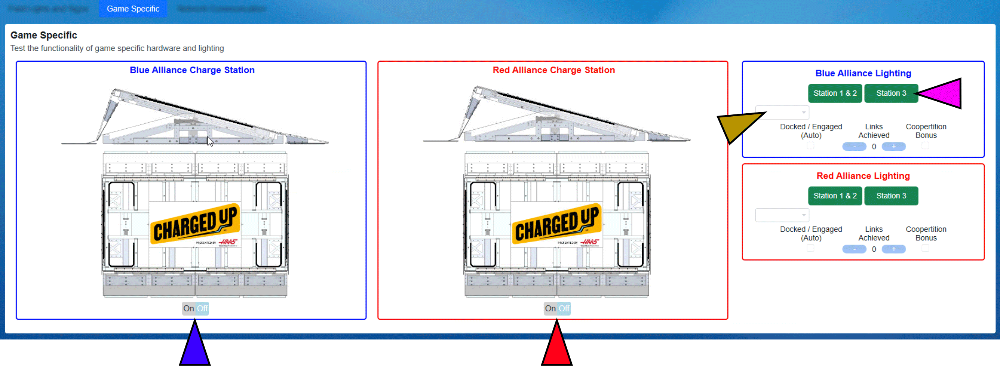

.. _field-test-game-specific:

Game Specific
======================

Field Test - Game Specific
##########################

You must use the "Refresh Indicators" button to update the colored status indicators on this tab. Note that the background alliance color indicates side of the field, not the alliance interacting with the element. For example, the Blue Power Port is on the Red Alliance side of the field, and therefore on top of the red background (right side of screen).

[Hardware Indicators Top Row (Gold Box)]

The indicators on the top row show the state of a hardware element, where a green background indicates successful communication and a red background indicates communication issues or failure. The "MiniSCC" is the high-speed counter box used in the Power Port (Goal). The MiniSCC on the Blue Alliance side is in the Blue Alliance field end, counting scored shots in the Red Power Port (and the same in reverse for Red). PowerPort PCK is the lighting controller for the corresponding Power Port. Shield ACC is the ACC cabinet box located on top of the truss structure. CtrlPanel IO Link is the control box at the scoring table for the Control Panels.

[PowerPort Lights (Orange Boxes)]

Using the drop down, step through all the possible lighting states for the Power Port.

[Truss Lights (Red Box)]

Toggle through the possible states for the lights on the truss, with the currently active state showing to the right of the button.

[Toggle Motors (Yellow Box)]

Click the toggle button to turn the motors on (or off). The current state is shown in the Low and Hi boxes based on the background. Make sure someone with visual of the Power Port provides an "all clear" before enabling a motor! The motor will automatically turn off after the designed time-out.

[Generator Switch Level (Green Box)]

Displays the current, real-time, status of the generator switch. A switch in the "level" range will show a green background.

[Control Panel Current Color (Light Blue Box)]

The current color being read by the sensor on the corresponding alliance's control panel. If no color can be read, or there is an error, the background will be Black.

[Truss/Trench Stacks (Pink Box)]

Toggle through the possible states of the truss and trench stack lights. The currently visible state will be shown in the black box to the right of the button.