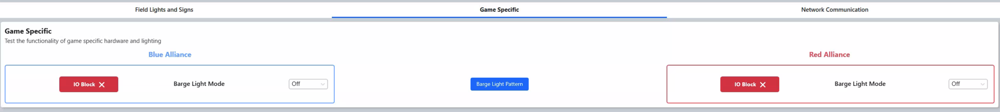

.. _field-test-game-specific:

Game Specific
======================

Field Test - Game Specific
##########################

IO Status blocks will be green or red to indicate whether they can be detected by FMS. 

The Barge Light Dropdown can be used to test individual light bars in the truss.

The Barge Light Pattern button can be used to run a preset pattern on the field truss.
