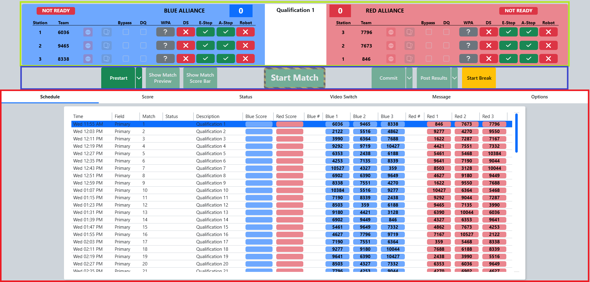
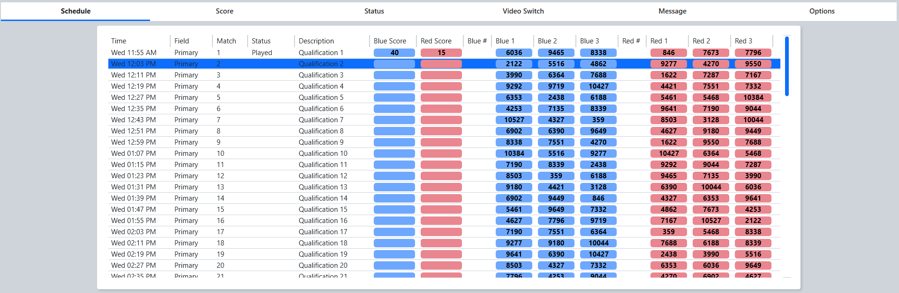

.. _match-play-index:

Match Play/Test
======================

Match Play (and :doc:`Match Test <match-test>`) are the most commonly used environments during an FRC event. The
screen is used to start and stop matches, disable robots, and control the Audience Display, and it is divided into
three sections.

Robot Status
------------

[*Green Box*] The top of the screen shows the current match number, the match time, the score for each alliance, and a
row of detail for every station. The status of each robot is reported to FMS by the SCCs and Driver Stations, and the
box colors correspond to the two ends of the playing field. See :ref:`Match Play <match-play>`.

Match State
-----------

[*Blue Box*] The buttons down the center step the match through its states — Prestart, Match Start, Commit, Post
Results, and control the audience display.  Many of the buttons have dropdowns with additional options.
See :ref:`Match Play <match-play>`.

Tabs
----

[*Red Box*] Tabs in the lower section provide more detailed information and allow for configuration of match play.

* :doc:`Schedule <schedule-tab>` - the currently active schedule, and where the match to play is selected
* :doc:`Score <score-tab>` - the counts for each scoring element, as entered by referees or collected automatically
* :doc:`Status <status-tab>` - connection information for every robot currently on the playing field
* :doc:`Video Switch <video-switch-tab>` - manual control of the Audience Display(s)
* :doc:`Message <message-tab>` - display messages on the background of the Audience Display(s)
* :doc:`Options <options-tab>` - match timing and other configuration options

.. toctree::
   :maxdepth: 1
   :hidden:

   interface
   match-test
