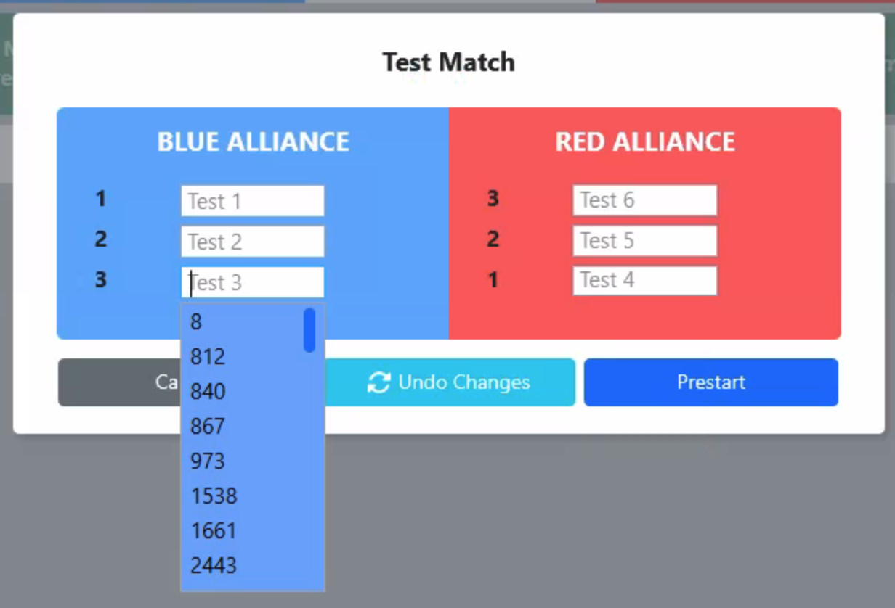
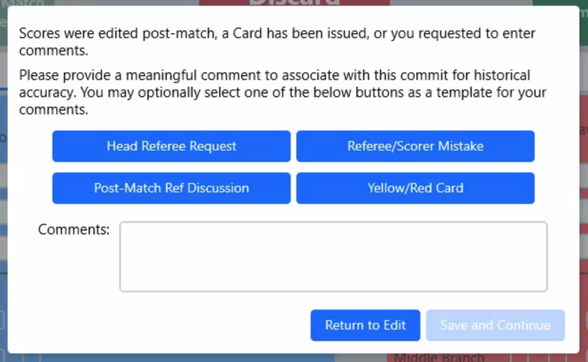
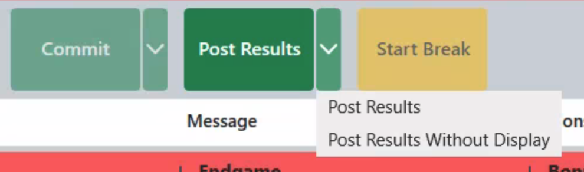

.. _match-play-interface:

Interface
===========

Match Play
-----------

Match Play (and Match Test) are the most commonly used environments during an FRC event. The screen is used to start and stop matches, disable robots, and control the Audience Display.

[*Green Box*] The top part of the screen shows the current match number, match time, score for the alliances and detail by station. Match time is updated in real time and will correspond with
the same information shown on the LED Displays. The status of the robots at each end of the playing field is communicated to FMS by the SCCs and DSs. The color of each box corresponds to each
end of the playing field, blue for the Blue Alliance, and red for the Red Alliance. Each box includes information on the status of the three robots on each alliance.

[*Blue Box*] Match Control is handled using the buttons in the center of the Match Play and Match Test screens.

[*Pink Box*] The lower portion of the screen changes based on the selected tab to display schedule information, detailed scoring, and more (described later)

Robot Status
--------------

Match score (yellow arrow) and timing information in the center of the display (green arrow), with time represented in minute:seconds to match the timers on the field. 
The match number is also displayed, and additional conditional indicators will appear below the timer as applicable (such as when a referee review is underway). 
The status indicator on the "Blue Alliance" and "Red Alliance" sides (indicated by the pink arrow) will turn from Red to Green when there is a known ready state for all Robots on that Alliance (connected or bypassed). 
In order for a match to start, both backgrounds must be green (known state for all Robots on the Field).

The top bar of Match Play also contains detailed station information- the background color indicates the alliance (Red or Blue) and meanings are detailed below. Markers in the example graphic are shown for Blue Alliance, though the layout is the same for the Red Alliance.

**Gray Arrows**

The fields left to right indicate information about the connection state of each Driver Station, Robot and Team.

#. Station - Assigned station for corresponding team (Stations are 1, 2 and 3 from left to right when viewed from within the Alliance Station)
#. Team - The team number which corresponds with the team designated to play in this station. Teams need to be in the correct station to ensure that they receive the proper Station ID and Position information from FMS.
#. Stop Button - used to Estop the robot during the match
#. Card State (entered by Head Referee, can only be edited after Match is over by toggling throgh possible states):

   * Green - no card, team in good standing
   * Yellow - team has been assigned a yellow card
   * Red - team assigned a red card in this match. Setting the indicator to red also bypasses the Player Station and automatically assigns the team a DQ for the current match. Note that in a subsequent match FMS will automatically change the red card to yellow

#. Byp - Select to bypass this particular station and force it to a ready (but disabled) state. (Note: During Match Test and Practice Matches only, the CTRL-SHIFT-B key combination will bypass all currently unconnected stations.)
#. DQ - Select to indicate that the corresponding team has been DQ’d for this match (will also cause Bypass)
#. WPA Key status:

   * Red with X - team has not been on the playing field
   * Yellow with Check - has linked with the field, but has not played in a match
   * Green with Check - the team has played in a match on the field

#. DS Status:

   * Red with X - Driver Station is not detected by the playing field (FMS-to-DS link is down)
   * Green with Check - Driver Station is detected by the field

#. Stop Status:

   * Red with A - Robot has been A-Stopped by the Team
   * Red with B - Robot has been E-Stopped by the Team (button)
   * Red with S - Robot has been E-Stopped by the Scoring Table
   * Green with Check - the team has played in a match on the field

#. Robot Status:

   * Red with X - Robot is not connected to the Driver Station
   * Green with Check - Robot is connected to the Driver Station

.. note::
   The amber light in each Player Station window indicate the Stop status of the corresponding team. A solid amber light means the Robot has been E-Stopped (regardless of who intiated the E-Stop) and a flashing amber light indicates a A-Stop (initated by the team, which will automatically clear upon entering the Teleoperated period)

.. warning::
   All E-Stops and A-Stops need to be in the up (released) position to prestart or begin a match. Prestarting a match with any Stop down will prompt a dialog box to be shown indicated in which Player Station the Stop(s) are down.

Match Control (FCUI)
---------------------

The buttons in the middle section are used to step through the Match process. In order to be available for use, a match must be selected from the Schedule tab.
This bar is commonly referred to as the "FCUI" or Field Control User Interface (which came from the former version, which was a piece of hardware on the scoring table).

* *Prestart* - prepares the field for the upcoming match by configuring the field hardware for the upcoming match
   
   *Prestart can be cancelled if necessary while it's running*

   *In Match Test/Practice/Playoff matches, clicking Prestart will allow for entry of team numbers (in playoff matches this is also used to move teams between stations)*

* *Show Match Preview* - display the Match Preview screen on the Audience Display(s) with team names and current ranking data for teams in the upcoming match
* *Show Match Score Bar* - display the real-time-score screen on the Audience Display(s)
* *Match Start* - starts the Match

  *  *Match Cancel* - cancels a match in progress (button text changes after start)
  * *Discard Match* - discard the match result and logs (button text changes after match ends)

.. warning::
   MUST ONLY BE USED WHEN THE FIELD IS IN A SAFE STATE AND NO HUMANS ARE IN DANGEROUS POSITIONS. FTA MUST GIVE PERMISSION FOR A MATCH TO START!

* *Commit* - confirm the score of the match and write the details to the database
* *Post Results* - display the final score and results on the Audience Display(s) and publish the results to the web (when applicable)

* *Start Break* - start or stop a timeout and update the Audience Display(s) with the timing data. Also updates the on field LED displays. Timeout duration can be changed on the "Options" tab.

Abort Match Option
------------------

Once a match has started, the "Start Match" option becomes "Abort Match" as shown, which requires confirmation before ending a Match in progress.
In non-emergency situations, the "Abort" option is preferred to the field E-Stop, as the E-Stop will put all Robots in an emergency shutdown state, whereas the "Abort" option will not.

Discard Match Option
---------------------

.. image:: images/interface-3b.png
    :align: center
    :width: 250

Once a match has ended, the "Abort Match" option becomes "Discard Match" as shown, which requires an HQ password / intervention to use.
The purpose of this option is to discard results and logs that will be declared invalid regardless, and thus bypass the need to commit and/or post the result (and risk it showing on the web).

Prestart Dropdown
-----------------

.. image:: images/interface-4.png
    :align: center
    :width: 350

The Prestart button has additional options available via a dropdown.

* *Prestart* - the "typical" Prestart process, as outlined in the previous section
* *Reset Network* - allows for re-programming of the field network hardware without a full "Prestart"
* *Reset Network With Team Change* - allows for re-programming of the field network hardware while also changing a team in one or more stations (disabled when not applicable, such as qualification matches)

.. note::
   The reset network option will not clear locked E-Stop and A-Stop states, instead a full "Back Out" and "Re-Prestart" is required to clear Stop flags.

Prestart Dropdown in Match Test/Practice
----------------------------------------

In some phases of the event, the Prestart button replaces "Prestart" with "Prestart Enter Teams." This happens in phases where FMS needs to know which teams are participating and in which positions, whereas in tradiitonal 
qualification matches teams cannot swap stations so no option is presented to adjust team numbers or positions. Clicking in one of the station boxes will present a list of participating teams to select from, or the 
team number can be entered using the keyboard. The team must be attending the event and have a generated WPA key in order to be available for Prestart.

* All other options work as described previously. Selecting Prestart Enter Teams will prompt for team numbers to participate in the match, as shown below. If teams were scheduled for the Match, they would be pre-populated in the display.

Commit Dropdown
---------------

The Commit button has additional options available via a dropdown.

* *Commit* - traditional path of committing scores as final
* *Commit with Comments* - allows for entering a comment before the scores are committed

At official events, if the scores were edited by the Scorekeeper after the match a comment will be required regardless of selection.
A comment is also required if any team was assigned a card. If required or requested, a box will appear during the commit process.
Select from the template buttons as a starting point for comments or type freely in the provided box.

Post-Results Dropdown
---------------------

The Post-Results button has additional options available via a dropdown.

* *Post Results* - traditional path of posting results from the Match to the Audience Display
* *Post Results Without Display -* allows for posting of results from the Match without changing the Audience Display

Break Start
----------------

.. image:: images/interface-10.png
    :align: center
    :width: 600

The Break Start button has additional options that present in a modal on click.

* *Break Time* - pick a default length or enter a custom length for the break (min:sec)
* *Enable Audio Warning* - (unchecked by default) when checked, audible queues will be emitted from the Audience Display as time expires
* *Match After Break* - indicate which Match # will be played after the break (for display to the Audience)
* *Show on Audience Display* - (unchecked by default) when checked, the Audience Display will reveal the timer when the Break is started

Alternate Flow
--------------

Some elements of the FCUI have "alternate flows". Above are examples are alternate flows for "Show Match Preview," clicking an alternate (yellow) button will return the FCUI to that step. 
Also shown is the style for Match Start, which has additional highlighting and padding due to the dangerous nature of enabling robots and starting a Match.

