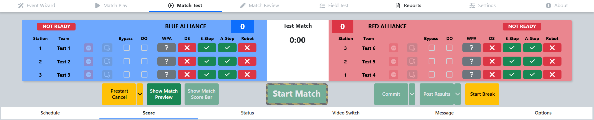

.. _match-play-test:

Match Test
===========

Match Test verifies that the electrical and scoring components connected to FMS are working correctly. It behaves
almost exactly like Match Play, so see :ref:`Match Play <match-play>` for the screen, its controls and its tabs — only
the differences are described here.

In Match Test, FMS assigns the match number 999 (998 for multi-field events) and names the teams "Test 1" through
"Test 6", unless those names have been changed in Settings. No schedule is loaded, so the Schedule tab stays blank.

Match Test cannot consume a schedule and therefore cannot play matches that "count." Use Match Play for Practice,
Qualification and Playoff matches.

Match Test uses its own set of WPA keys for the test robots. Enter the number of a team registered for the event into a
Player Station and that team's own WPA key is used instead. Alternate sets of test robots are available for events with
multiple fields, such as the *FIRST* Championship — contact support to arrange them.

Naming a Test Match
-------------------

The Prestart Enter Teams dialog shows a text box for the match description, which appears only in Match Test. Type a
name of up to 100 characters and it replaces "Test Match" when Prestart is confirmed: FMS writes it to the match's
schedule detail, and it appears in the FMS header and on the Audience Display — the match preview, the lower third of
the score bar, and the results screen.

This is intended for off-season events that run a playoff tournament in Match Test, where each match can be given a
meaningful name such as "Quarterfinal 1" rather than showing as "Test Match" to the audience.
