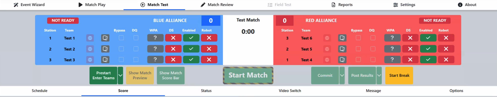

Match Test
==========

The Match Test functionally is nearly identical to Match Play. When using Match Test the FMS automatically assigns the match number to 999 (or 998 for multi-field events) and the team numbers to “Test Robot 1” through 6 and no schedule is displayed. Match Test is used to verify all electrical and scoring components connected to the FMS are operating correctly.

Note that Match Test uses a specific set of WPA Keys for Test Robots 1-6, but will use the corresponding WPA key for a team registered for the event when its number is entered into a Player Station. Note that alternate sets of test robots are available for events with multiple fields, such as the *FIRST* Championship, by contacting support.

The schedule tab will remain blank in Match Test.

Match Test cannot consume a schedule, and therefore cannot be used to play Matches that "count." To play Matches in the Practice/Qual/Playoff schedule, Match Play must be used.

